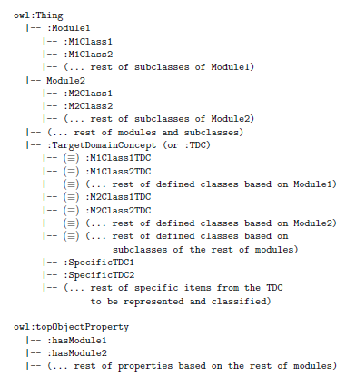

* [Image](../Image/NormalizationGenericStructure1.png#file)
* [File history](../Image/NormalizationGenericStructure1.png#filehistory)
* [Links](../Image/NormalizationGenericStructure1.png#filelinks)

  
No higher resolution available.  
[NormalizationGenericStructure1.png](../images/2/23/NormalizationGenericStructure1.png)‎ (392 × 426 pixel, file size: 31 KB, MIME type: image/png)Generic structure of the Normalization ODP.

## File history

Click on a date/time to view the file as it appeared at that time.

  
* [Search for duplicate files](http://ontologydesignpatterns.org/wiki/Special:FileDuplicateSearch/NormalizationGenericStructure1.png "Special:FileDuplicateSearch/NormalizationGenericStructure1.png")
* [Edit this file using an external application](http://ontologydesignpatterns.org/wiki/index.php?title=Image:NormalizationGenericStructure1.png&action=edit&externaledit=true&mode=file "Image:NormalizationGenericStructure1.png")See the [setup instructions](http://www.mediawiki.org/wiki/Manual:External_editors "http://www.mediawiki.org/wiki/Manual:External_editors") for more information.

## Links

The following page links to this file:

* [Submissions:Faceted Classification Scheme](../Submissions/Faceted_Classification_Scheme "Submissions:Faceted Classification Scheme")

Retrieved from "[http://ontologydesignpatterns.org/wiki/Image:NormalizationGenericStructure1.png](../Image/NormalizationGenericStructure1.png)"