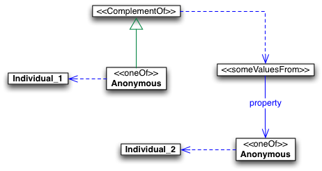

* [Image](../Image/Npa-diagram.png#file)
* [File history](../Image/Npa-diagram.png#filehistory)
* [Links](../Image/Npa-diagram.png#filelinks)

  
No higher resolution available.  
[Npa-diagram.png](../images/f/f1/Npa-diagram.png)‎ (462 × 246 pixel, file size: 26 KB, MIME type: image/png)Diagram for the NPA pattern

## File history

Click on a date/time to view the file as it appeared at that time.

  
* [Search for duplicate files](http://ontologydesignpatterns.org/wiki/Special:FileDuplicateSearch/Npa-diagram.png "Special:FileDuplicateSearch/Npa-diagram.png")
* [Edit this file using an external application](http://ontologydesignpatterns.org/wiki/index.php?title=Image:Npa-diagram.png&action=edit&externaledit=true&mode=file "Image:Npa-diagram.png")See the [setup instructions](http://www.mediawiki.org/wiki/Manual:External_editors "http://www.mediawiki.org/wiki/Manual:External_editors") for more information.

## Links

The following page links to this file:

* [Submissions:NegativePropertyAssertions](../Submissions/NegativePropertyAssertions "Submissions:NegativePropertyAssertions")

Retrieved from "[http://ontologydesignpatterns.org/wiki/Image:Npa-diagram.png](../Image/Npa-diagram.png)"