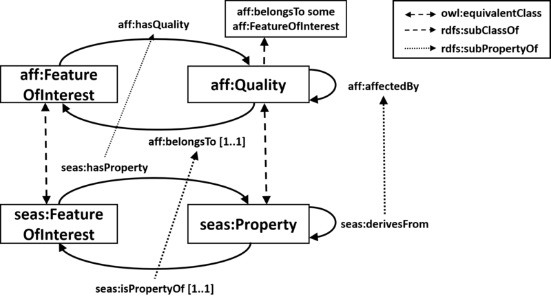

* [Image](../Image/ODPAffectedBy_Diagram.png#file)
* [File history](../Image/ODPAffectedBy_Diagram.png#filehistory)
* [Links](../Image/ODPAffectedBy_Diagram.png#filelinks)

  
Size of this preview: 800 × 441 pixels  
[Full resolution](../images/8/8a/ODPAffectedBy_Diagram.png)‎ (1,888 × 1,040 pixel, file size: 80 KB, MIME type: image/png)Diagram of the AffectedBy ODP

## File history

Click on a date/time to view the file as it appeared at that time.

  
* [Search for duplicate files](http://ontologydesignpatterns.org/wiki/Special:FileDuplicateSearch/ODPAffectedBy_Diagram.png "Special:FileDuplicateSearch/ODPAffectedBy Diagram.png")
* [Edit this file using an external application](http://ontologydesignpatterns.org/wiki/index.php?title=Image:ODPAffectedBy_Diagram.png&action=edit&externaledit=true&mode=file "Image:ODPAffectedBy Diagram.png")See the [setup instructions](http://www.mediawiki.org/wiki/Manual:External_editors "http://www.mediawiki.org/wiki/Manual:External_editors") for more information.

## Links

The following page links to this file:

* [Submissions:AffectedBy](../Submissions/AffectedBy "Submissions:AffectedBy")

Retrieved from "[http://ontologydesignpatterns.org/wiki/Image:ODPAffectedBy\_Diagram.png](../Image/ODPAffectedBy_Diagram.png)"