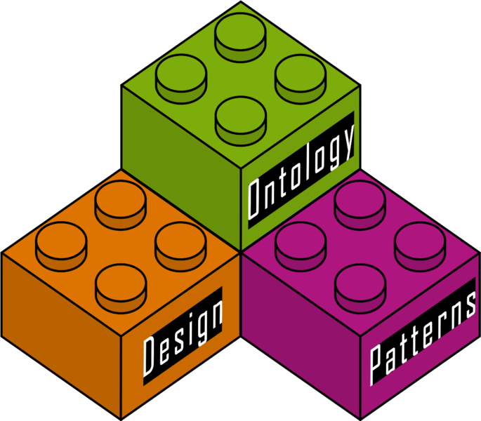

* [Image](../Image/ODP_Logo_LEGO_Bricks.svg#file)
* [File history](../Image/ODP_Logo_LEGO_Bricks.svg#filehistory)
* [Links](../Image/ODP_Logo_LEGO_Bricks.svg#filelinks)

  

[ODP\_Logo\_LEGO\_Bricks.svg](../images/d/d1/ODP_Logo_LEGO_Bricks.svg "ODP Logo LEGO Bricks.svg")‎  (SVG file, nominally 1,141 × 999 pixels, file size: 19 KB)

Scalable Vector Graphics (SVG) version of the ODP Logo

## File history

Click on a date/time to view the file as it appeared at that time.

  
* [Search for duplicate files](http://ontologydesignpatterns.org/wiki/Special:FileDuplicateSearch/ODP_Logo_LEGO_Bricks.svg "Special:FileDuplicateSearch/ODP Logo LEGO Bricks.svg")
* [Edit this file using an external application](http://ontologydesignpatterns.org/wiki/index.php?title=Image:ODP_Logo_LEGO_Bricks.svg&action=edit&externaledit=true&mode=file "Image:ODP Logo LEGO Bricks.svg")See the [setup instructions](http://www.mediawiki.org/wiki/Manual:External_editors "http://www.mediawiki.org/wiki/Manual:External_editors") for more information.

## Links

There are no pages that link to this file.

Retrieved from "[http://ontologydesignpatterns.org/wiki/Image:ODP\_Logo\_LEGO\_Bricks.svg](../Image/ODP_Logo_LEGO_Bricks.svg)"