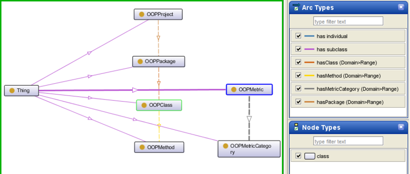

* [Image](../Image/OOPMetricsDiagram.png#file)
* [File history](../Image/OOPMetricsDiagram.png#filehistory)
* [Links](../Image/OOPMetricsDiagram.png#filelinks)

  
Size of this preview: 800 × 339 pixels  
[Full resolution](../images/0/0a/OOPMetricsDiagram.png)‎ (874 × 370 pixel, file size: 39 KB, MIME type: image/png)

## File history

Click on a date/time to view the file as it appeared at that time.

  
* [Search for duplicate files](http://ontologydesignpatterns.org/wiki/Special:FileDuplicateSearch/OOPMetricsDiagram.png "Special:FileDuplicateSearch/OOPMetricsDiagram.png")
* [Edit this file using an external application](http://ontologydesignpatterns.org/wiki/index.php?title=Image:OOPMetricsDiagram.png&action=edit&externaledit=true&mode=file "Image:OOPMetricsDiagram.png")See the [setup instructions](http://www.mediawiki.org/wiki/Manual:External_editors "http://www.mediawiki.org/wiki/Manual:External_editors") for more information.

## Links

The following page links to this file:

* [Submissions:OOPMetrics](../Submissions/OOPMetrics "Submissions:OOPMetrics")

Retrieved from "[http://ontologydesignpatterns.org/wiki/Image:OOPMetricsDiagram.png](../Image/OOPMetricsDiagram.png)"