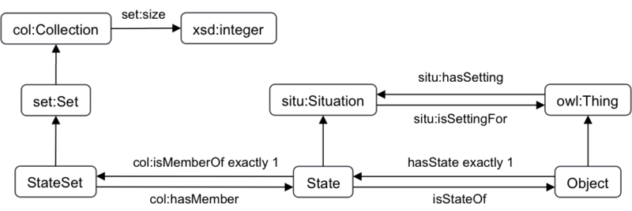

* [Image](../Image/ObjectWithStatesODP.png.md#file)
* [File history](../Image/ObjectWithStatesODP.png.md#filehistory)
* [Links](../Image/ObjectWithStatesODP.png.md#filelinks)

  
Size of this preview: 800 × 268 pixels  
[Full resolution](../../images/1/11/ObjectWithStatesODP.png)‎ (910 × 305 pixel, file size: 40 KB, MIME type: image/png)Picture of the Object with states Content Ontology Design Pattern

## File history

Click on a date/time to view the file as it appeared at that time.

  
* [Search for duplicate files](http://ontologydesignpatterns.org/wiki/Special:FileDuplicateSearch/ObjectWithStatesODP.png "Special:FileDuplicateSearch/ObjectWithStatesODP.png")
* [Edit this file using an external application](http://ontologydesignpatterns.org/wiki/index.php?title=Image:ObjectWithStatesODP.png&action=edit&externaledit=true&mode=file "Image:ObjectWithStatesODP.png")See the [setup instructions](http://www.mediawiki.org/wiki/Manual:External_editors "http://www.mediawiki.org/wiki/Manual:External_editors") for more information.

## Links

The following page links to this file:

* [Submissions:Object with states](../Submissions/Object_with_states.md "Submissions:Object with states")

Retrieved from "[http://ontologydesignpatterns.org/wiki/Image:ObjectWithStatesODP.png](../Image/ObjectWithStatesODP.png.md)"