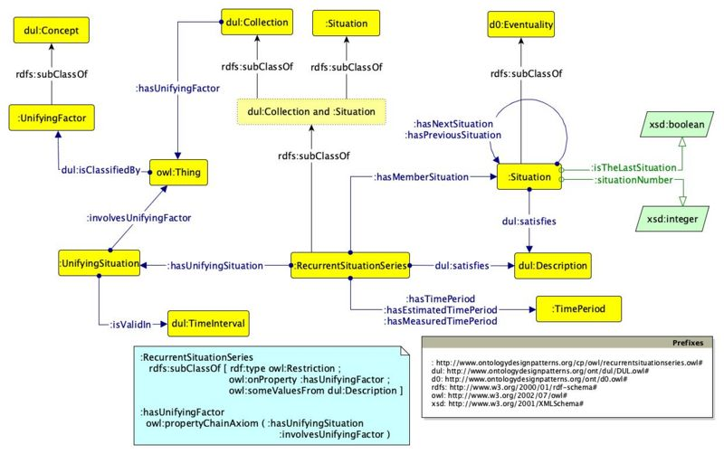

* [Image](../Image/Odp-recurrent-situation-series.jpg.md#file)
* [File history](../Image/Odp-recurrent-situation-series.jpg.md#filehistory)
* [Links](../Image/Odp-recurrent-situation-series.jpg.md#filelinks)

  
Size of this preview: 800 × 502 pixels  
[Full resolution](../../images/4/4e/Odp-recurrent-situation-series.jpg)‎ (1,240 × 778 pixel, file size: 118 KB, MIME type: image/jpeg)

## File history

Click on a date/time to view the file as it appeared at that time.

  
* [Search for duplicate files](http://ontologydesignpatterns.org/wiki/Special:FileDuplicateSearch/Odp-recurrent-situation-series.jpg "Special:FileDuplicateSearch/Odp-recurrent-situation-series.jpg")
* [Edit this file using an external application](http://ontologydesignpatterns.org/wiki/index.php?title=Image:Odp-recurrent-situation-series.jpg&action=edit&externaledit=true&mode=file "Image:Odp-recurrent-situation-series.jpg")See the [setup instructions](http://www.mediawiki.org/wiki/Manual:External_editors "http://www.mediawiki.org/wiki/Manual:External_editors") for more information.

## Links

There are no pages that link to this file.

Retrieved from "[http://ontologydesignpatterns.org/wiki/Image:Odp-recurrent-situation-series.jpg](../Image/Odp-recurrent-situation-series.jpg.md)"