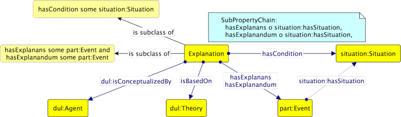

* [Image](../Image/Odp.png.md#file)
* [File history](../Image/Odp.png.md#filehistory)
* [Links](../Image/Odp.png.md#filelinks)

[](../../images/0/0a/Odp.png)  
Size of this preview: 800 × 234 pixels  
[Full resolution](../../images/0/0a/Odp.png)‎ (1,330 × 389 pixel, file size: 216 KB, MIME type: image/png)
```
Ontology design pattern to define the concept of Explanation

```


## File history

Click on a date/time to view the file as it appeared at that time.


  
* [Search for duplicate files](http://ontologydesignpatterns.org/wiki/Special:FileDuplicateSearch/Odp.png "Special:FileDuplicateSearch/Odp.png")
* [Edit this file using an external application](http://ontologydesignpatterns.org/wiki/index.php?title=Image:Odp.png&action=edit&externaledit=true&mode=file "Image:Odp.png")See the [setup instructions](http://www.mediawiki.org/wiki/Manual:External_editors "http://www.mediawiki.org/wiki/Manual:External_editors") for more information.

## Links


The following page links to this file:


* [Submissions:ExplanationODP](../Submissions/ExplanationODP.md "Submissions:ExplanationODP")


Retrieved from "[http://ontologydesignpatterns.org/wiki/Image:Odp.png](../Image/Odp.png.md)"