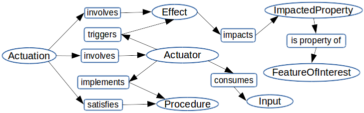

* [Image](../Image/Odp_AAE.png.md#file)
* [File history](../Image/Odp_AAE.png.md#filehistory)
* [Links](../Image/Odp_AAE.png.md#filelinks)

  
No higher resolution available.  
[Odp\_AAE.png](../images/2/20/Odp_AAE.png)‎ (729 × 227 pixel, file size: 63 KB, MIME type: image/png)Illustration of the AAE (Actuation-Actuator-Effect) design pattern.

## File history

Click on a date/time to view the file as it appeared at that time.

  
* [Search for duplicate files](http://ontologydesignpatterns.org/wiki/Special:FileDuplicateSearch/Odp_AAE.png "Special:FileDuplicateSearch/Odp AAE.png")
* [Edit this file using an external application](http://ontologydesignpatterns.org/wiki/index.php?title=Image:Odp_AAE.png&action=edit&externaledit=true&mode=file "Image:Odp AAE.png")See the [setup instructions](http://www.mediawiki.org/wiki/Manual:External_editors "http://www.mediawiki.org/wiki/Manual:External_editors") for more information.

## Links

The following page links to this file:

* [Submissions:Actuation-Actuator-Effect](../Submissions/Actuation-Actuator-Effect.md "Submissions:Actuation-Actuator-Effect")

Retrieved from "[http://ontologydesignpatterns.org/wiki/Image:Odp\_AAE.png](../Image/Odp_AAE.png.md)"