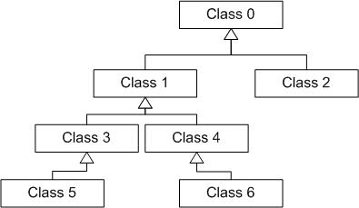

* [Image](../Image/Ontology.png.md#file)
* [File history](../Image/Ontology.png.md#filehistory)
* [Links](../Image/Ontology.png.md#filelinks)

  
No higher resolution available.  
[Ontology.png](../images/8/8d/Ontology.png)‎ (395 × 229 pixel, file size: 21 KB, MIME type: image/png)

## File history

Click on a date/time to view the file as it appeared at that time.

  
* [Search for duplicate files](http://ontologydesignpatterns.org/wiki/Special:FileDuplicateSearch/Ontology.png "Special:FileDuplicateSearch/Ontology.png")
* [Edit this file using an external application](http://ontologydesignpatterns.org/wiki/index.php?title=Image:Ontology.png&action=edit&externaledit=true&mode=file "Image:Ontology.png")See the [setup instructions](http://www.mediawiki.org/wiki/Manual:External_editors "http://www.mediawiki.org/wiki/Manual:External_editors") for more information.

## Links

The following 6 pages link to this file:

* [Submissions:Classification scheme - path enumeration model - to Taxonomy](../Submissions/Classification_scheme_-_path_enumeration_model_-_to_Taxonomy.md "Submissions:Classification scheme - path enumeration model - to Taxonomy")
* [Submissions:Classification scheme - adjacency list model - to Taxonomy](../Submissions/Classification_scheme_-_adjacency_list_model_-_to_Taxonomy.md "Submissions:Classification scheme - adjacency list model - to Taxonomy")
* [Submissions:Pattern for re-engineering a classification scheme, which follows the path enumeration data model, into an ontology schema](../Submissions/Pattern_for_re-engineering_a_classification_scheme,_which_follows_the_path_enumeration_data_model,_into_an_ontology_schema.md "Submissions:Pattern for re-engineering a classification scheme, which follows the path enumeration data model, into an ontology schema")
* [Submissions:Pattern for re-engineering a classification scheme, which follows the adjacency list data model, into an ontology schema](../Submissions/Pattern_for_re-engineering_a_classification_scheme,_which_follows_the_adjacency_list_data_model,_into_an_ontology_schema.md "Submissions:Pattern for re-engineering a classification scheme, which follows the adjacency list data model, into an ontology schema")
* [Submissions:Pattern for re-engineering a classification scheme, which follows the snowflake data model, into an ontology schema](../Submissions/Pattern_for_re-engineering_a_classification_scheme,_which_follows_the_snowflake_data_model,_into_an_ontology_schema.md "Submissions:Pattern for re-engineering a classification scheme, which follows the snowflake data model, into an ontology schema")
* [Submissions:Pattern for re-engineering a classification scheme, which follows the flattened data model, into an ontology schema](../Submissions/Pattern_for_re-engineering_a_classification_scheme,_which_follows_the_flattened_data_model,_into_an_ontology_schema.md "Submissions:Pattern for re-engineering a classification scheme, which follows the flattened data model, into an ontology schema")

Retrieved from "[http://ontologydesignpatterns.org/wiki/Image:Ontology.png](../Image/Ontology.png.md)"