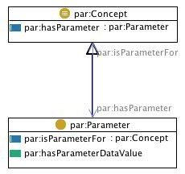

* [Image](../Image/Parameter.jpg.md#file)
* [File history](../Image/Parameter.jpg.md#filehistory)
* [Links](../Image/Parameter.jpg.md#filelinks)

  
No higher resolution available.  
[Parameter.jpg](../images/5/56/Parameter.jpg)‎ (230 × 216 pixel, file size: 14 KB, MIME type: image/jpeg)

## File history

Click on a date/time to view the file as it appeared at that time.

  
* [Search for duplicate files](http://ontologydesignpatterns.org/wiki/Special:FileDuplicateSearch/Parameter.jpg "Special:FileDuplicateSearch/Parameter.jpg")
* [Edit this file using an external application](http://ontologydesignpatterns.org/wiki/index.php?title=Image:Parameter.jpg&action=edit&externaledit=true&mode=file "Image:Parameter.jpg")See the [setup instructions](http://www.mediawiki.org/wiki/Manual:External_editors "http://www.mediawiki.org/wiki/Manual:External_editors") for more information.

## Links

The following 2 pages link to this file:

* [Community:Images](../Community/Images.md "Community:Images")
* [Submissions:Parameter](../Submissions/Parameter.md "Submissions:Parameter")

Retrieved from "[http://ontologydesignpatterns.org/wiki/Image:Parameter.jpg](../Image/Parameter.jpg.md)"