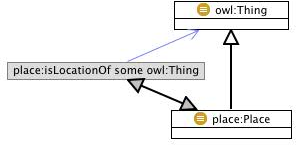

* [Image](../Image/Place.png#file)
* [File history](../Image/Place.png#filehistory)
* [Links](../Image/Place.png#filelinks)

  
No higher resolution available.  
[Place.png](../images/f/f7/Place.png)‎ (296 × 145 pixel, file size: 18 KB, MIME type: image/png)

## File history

Click on a date/time to view the file as it appeared at that time.

  
* [Search for duplicate files](http://ontologydesignpatterns.org/wiki/Special:FileDuplicateSearch/Place.png "Special:FileDuplicateSearch/Place.png")
* [Edit this file using an external application](http://ontologydesignpatterns.org/wiki/index.php?title=Image:Place.png&action=edit&externaledit=true&mode=file "Image:Place.png")See the [setup instructions](http://www.mediawiki.org/wiki/Manual:External_editors "http://www.mediawiki.org/wiki/Manual:External_editors") for more information.

## Links

The following 2 pages link to this file:

* [Submissions:Place](../Submissions/Place "Submissions:Place")
* [Odp:Tasks/Make it easy to add images to Modeling Issues](../Odp/Tasks/Make_it_easy_to_add_images_to_Modeling_Issues "Odp:Tasks/Make it easy to add images to Modeling Issues")

Retrieved from "[http://ontologydesignpatterns.org/wiki/Image:Place.png](../Image/Place.png)"