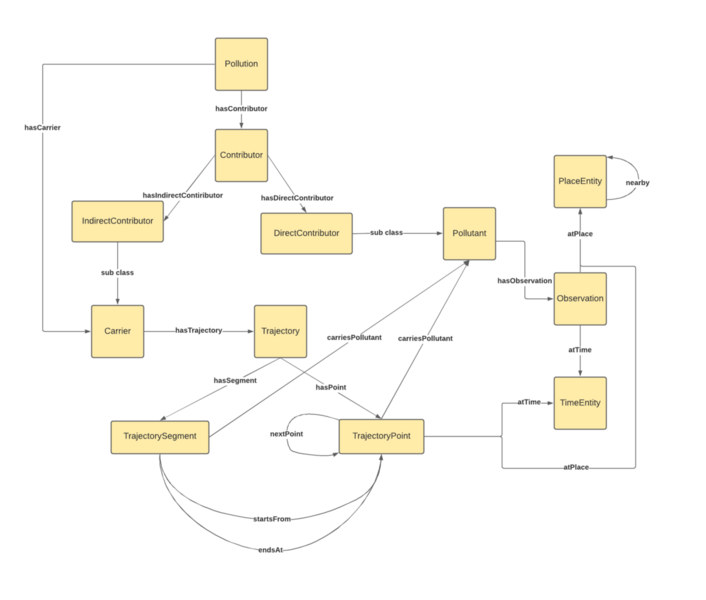

* [Image](../Image/PollutionODPFin.png#file)
* [File history](../Image/PollutionODPFin.png#filehistory)
* [Links](../Image/PollutionODPFin.png#filelinks)

  
Size of this preview: 706 × 600 pixels  
[Full resolution](../images/7/70/PollutionODPFin.png)‎ (1,084 × 921 pixel, file size: 93 KB, MIME type: image/png)The Pollution ontology design pattern (ODP) intends to model the pollution, the pollutants and their observations at various spatio-temporal points. It also captures the information about the various direct and indirect sources of pollution. The Pollution ODP makes use of Trajectory, Observation and Stub-Metapattern ODPs. The ODP can be used for various kinds of pollution such as air, water, soil, space debris and sound.

## File history

Click on a date/time to view the file as it appeared at that time.

  
* [Search for duplicate files](http://ontologydesignpatterns.org/wiki/Special:FileDuplicateSearch/PollutionODPFin.png "Special:FileDuplicateSearch/PollutionODPFin.png")
* [Edit this file using an external application](http://ontologydesignpatterns.org/wiki/index.php?title=Image:PollutionODPFin.png&action=edit&externaledit=true&mode=file "Image:PollutionODPFin.png")See the [setup instructions](http://www.mediawiki.org/wiki/Manual:External_editors "http://www.mediawiki.org/wiki/Manual:External_editors") for more information.

## Links

There are no pages that link to this file.

Retrieved from "[http://ontologydesignpatterns.org/wiki/Image:PollutionODPFin.png](../Image/PollutionODPFin.png)"