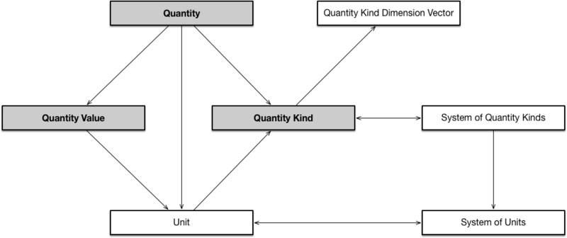

* [Image](../Image/Quantity_Triad_Pattern.png#file)
* [File history](../Image/Quantity_Triad_Pattern.png#filehistory)
* [Links](../Image/Quantity_Triad_Pattern.png#filelinks)

  
Size of this preview: 800 × 336 pixels  
[Full resolution](../images/3/3d/Quantity_Triad_Pattern.png)‎ (991 × 416 pixel, file size: 33 KB, MIME type: image/png)Overall Quantity-Triad pattern diagram, showing dependencies between QuantityKinds, SystemsOfQuantityKinds, Units, SystemOfUnits, Quantities, QuantityValues, and QuantityKindDimensionVectors.

## File history

Click on a date/time to view the file as it appeared at that time.

  
* [Search for duplicate files](http://ontologydesignpatterns.org/wiki/Special:FileDuplicateSearch/Quantity_Triad_Pattern.png "Special:FileDuplicateSearch/Quantity Triad Pattern.png")
* [Edit this file using an external application](http://ontologydesignpatterns.org/wiki/index.php?title=Image:Quantity_Triad_Pattern.png&action=edit&externaledit=true&mode=file "Image:Quantity Triad Pattern.png")See the [setup instructions](http://www.mediawiki.org/wiki/Manual:External_editors "http://www.mediawiki.org/wiki/Manual:External_editors") for more information.

## Links

The following page links to this file:

* [Submissions:Quantity Triad Pattern](../Submissions/Quantity_Triad_Pattern "Submissions:Quantity Triad Pattern")

Retrieved from "[http://ontologydesignpatterns.org/wiki/Image:Quantity\_Triad\_Pattern.png](../Image/Quantity_Triad_Pattern.png)"