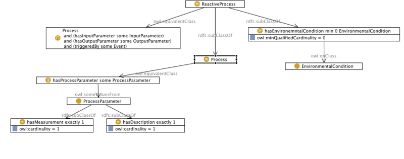

* [Image](../Image/Reactor-pattern.png.md#file)
* [File history](../Image/Reactor-pattern.png.md#filehistory)
* [Links](../Image/Reactor-pattern.png.md#filelinks)

[](../../images/4/4b/Reactor-pattern.png)  
Size of this preview: 800 × 316 pixels  
[Full resolution](../../images/4/4b/Reactor-pattern.png)‎ (1,003 × 396 pixel, file size: 36 KB, MIME type: image/png)
```
The Reactor Pattern  enables the
 modelling of processes that consume inputs and produce outputs under
 specific environmental conditions and on being triggered by certain
 events. Reactor pattern is a content ontology design pattern and is
 especially targeted towards modelling reactive processes with a
 ``black box _view of the process._

```


## File history

Click on a date/time to view the file as it appeared at that time.


  
* [Search for duplicate files](http://ontologydesignpatterns.org/wiki/Special:FileDuplicateSearch/Reactor-pattern.png "Special:FileDuplicateSearch/Reactor-pattern.png")
* [Edit this file using an external application](http://ontologydesignpatterns.org/wiki/index.php?title=Image:Reactor-pattern.png&action=edit&externaledit=true&mode=file "Image:Reactor-pattern.png")See the [setup instructions](http://www.mediawiki.org/wiki/Manual:External_editors "http://www.mediawiki.org/wiki/Manual:External_editors") for more information.

## Links


The following page links to this file:


* [Submissions:Reactor pattern](../Submissions/Reactor_pattern.md "Submissions:Reactor pattern")


Retrieved from "[http://ontologydesignpatterns.org/wiki/Image:Reactor-pattern.png](../Image/Reactor-pattern.png.md)"