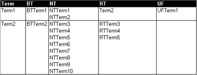

* [Image](../Image/Recordbasedtermbased.png.md#file)
* [File history](../Image/Recordbasedtermbased.png.md#filehistory)
* [Links](../Image/Recordbasedtermbased.png.md#filelinks)

  
No higher resolution available.  
[Recordbasedtermbased.png](../images/a/af/Recordbasedtermbased.png)‎ (400 × 152 pixel, file size: 12 KB, MIME type: image/png)

## File history

Click on a date/time to view the file as it appeared at that time.

  
* [Search for duplicate files](http://ontologydesignpatterns.org/wiki/Special:FileDuplicateSearch/Recordbasedtermbased.png "Special:FileDuplicateSearch/Recordbasedtermbased.png")
* [Edit this file using an external application](http://ontologydesignpatterns.org/wiki/index.php?title=Image:Recordbasedtermbased.png&action=edit&externaledit=true&mode=file "Image:Recordbasedtermbased.png")See the [setup instructions](http://www.mediawiki.org/wiki/Manual:External_editors "http://www.mediawiki.org/wiki/Manual:External_editors") for more information.

## Links

The following 2 pages link to this file:

* [Submissions:Term-based – record-based model – thesaurus to lightweight ontology](http://ontologydesignpatterns.org/wiki/Submissions:Term-based_%E2%80%93_record-based_model_%E2%80%93_thesaurus_to_lightweight_ontology "Submissions:Term-based – record-based model – thesaurus to lightweight ontology")
* [Submissions:Pattern for re-engineering a term-based thesaurus, which follows the recordbased data model, into an ontology schema](../Submissions/Pattern_for_re-engineering_a_term-based_thesaurus,_which_follows_the_recordbased_data_model,_into_an_ontology_schema.md "Submissions:Pattern for re-engineering a term-based thesaurus, which follows the recordbased data model, into an ontology schema")

Retrieved from "[http://ontologydesignpatterns.org/wiki/Image:Recordbasedtermbased.png](../Image/Recordbasedtermbased.png.md)"