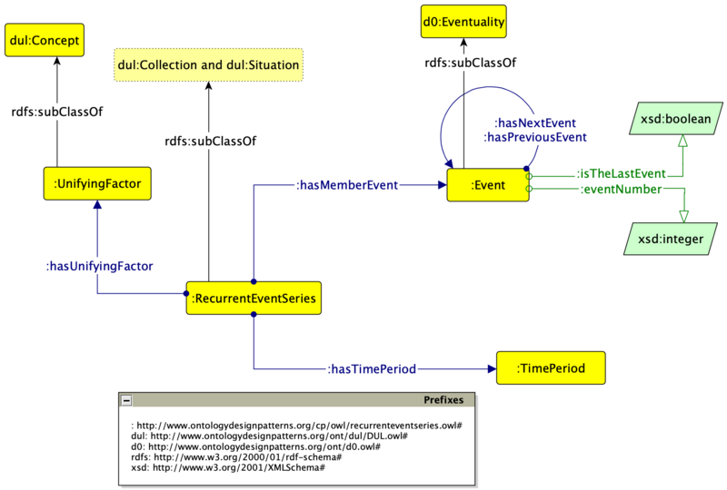

* [Image](../Image/Recurrent-event-series-last.png.md#file)
* [File history](../Image/Recurrent-event-series-last.png.md#filehistory)
* [Links](../Image/Recurrent-event-series-last.png.md#filelinks)

  
Size of this preview: 800 × 540 pixels  
[Full resolution](../../images/3/30/Recurrent-event-series-last.png)‎ (1,952 × 1,318 pixel, file size: 224 KB, MIME type: image/png)Recurrent Event Series ODP, new datatype properties

## File history

Click on a date/time to view the file as it appeared at that time.

  
* [Search for duplicate files](http://ontologydesignpatterns.org/wiki/Special:FileDuplicateSearch/Recurrent-event-series-last.png "Special:FileDuplicateSearch/Recurrent-event-series-last.png")
* [Edit this file using an external application](http://ontologydesignpatterns.org/wiki/index.php?title=Image:Recurrent-event-series-last.png&action=edit&externaledit=true&mode=file "Image:Recurrent-event-series-last.png")See the [setup instructions](http://www.mediawiki.org/wiki/Manual:External_editors "http://www.mediawiki.org/wiki/Manual:External_editors") for more information.

## Links

There are no pages that link to this file.

Retrieved from "[http://ontologydesignpatterns.org/wiki/Image:Recurrent-event-series-last.png](../Image/Recurrent-event-series-last.png.md)"