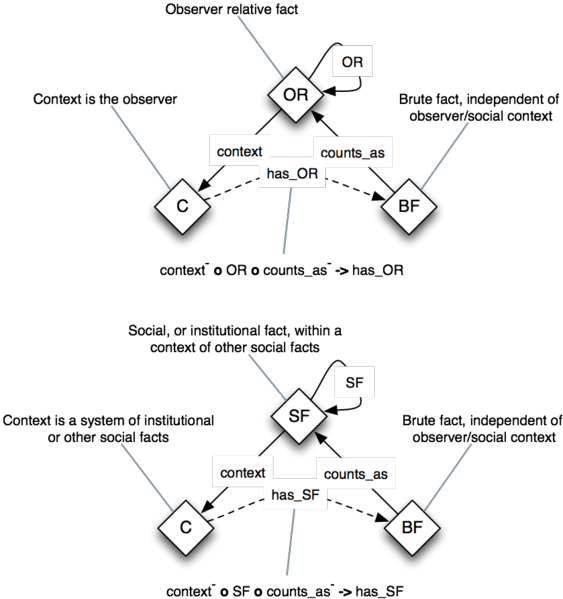

* [Image](../Image/Relative-facts.png.md#file)
* [File history](../Image/Relative-facts.png.md#filehistory)
* [Links](../Image/Relative-facts.png.md#filelinks)

  
Size of this preview: 563 × 599 pixels  
[Full resolution](../images/2/2a/Relative-facts.png)‎ (839 × 893 pixel, file size: 137 KB, MIME type: image/png)Design pattern for relative facts (observer relative, institutional) based on Searle, 1995

## File history

Click on a date/time to view the file as it appeared at that time.

  
* [Search for duplicate files](http://ontologydesignpatterns.org/wiki/Special:FileDuplicateSearch/Relative-facts.png "Special:FileDuplicateSearch/Relative-facts.png")
* [Edit this file using an external application](http://ontologydesignpatterns.org/wiki/index.php?title=Image:Relative-facts.png&action=edit&externaledit=true&mode=file "Image:Relative-facts.png")See the [setup instructions](http://www.mediawiki.org/wiki/Manual:External_editors "http://www.mediawiki.org/wiki/Manual:External_editors") for more information.

## Links

The following page links to this file:

* [Submissions:Social Reality (OWL 2)](../Submissions/Social_Reality_(OWL_2).md).md).html "Submissions:Social Reality (OWL 2)")

Retrieved from "[http://ontologydesignpatterns.org/wiki/Image:Relative-facts.png](../Image/Relative-facts.png.md)"