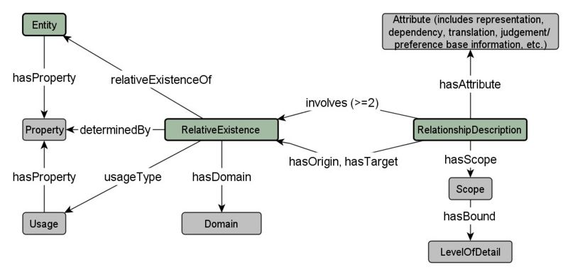

* [Image](../Image/RelativeRelationshipPattern.jpg.md#file)
* [File history](../Image/RelativeRelationshipPattern.jpg.md#filehistory)
* [Links](../Image/RelativeRelationshipPattern.jpg.md#filelinks)

  
Size of this preview: 800 × 383 pixels  
[Full resolution](../../images/2/27/RelativeRelationshipPattern.jpg)‎ (1,110 × 532 pixel, file size: 77 KB, MIME type: image/jpeg)

## File history

Click on a date/time to view the file as it appeared at that time.

  
* [Search for duplicate files](http://ontologydesignpatterns.org/wiki/Special:FileDuplicateSearch/RelativeRelationshipPattern.jpg "Special:FileDuplicateSearch/RelativeRelationshipPattern.jpg")
* [Edit this file using an external application](http://ontologydesignpatterns.org/wiki/index.php?title=Image:RelativeRelationshipPattern.jpg&action=edit&externaledit=true&mode=file "Image:RelativeRelationshipPattern.jpg")See the [setup instructions](http://www.mediawiki.org/wiki/Manual:External_editors "http://www.mediawiki.org/wiki/Manual:External_editors") for more information.

## Links

The following page links to this file:

* [Submissions:RelativeRelationship](../Submissions/RelativeRelationship.md "Submissions:RelativeRelationship")

Retrieved from "[http://ontologydesignpatterns.org/wiki/Image:RelativeRelationshipPattern.jpg](../Image/RelativeRelationshipPattern.jpg.md)"