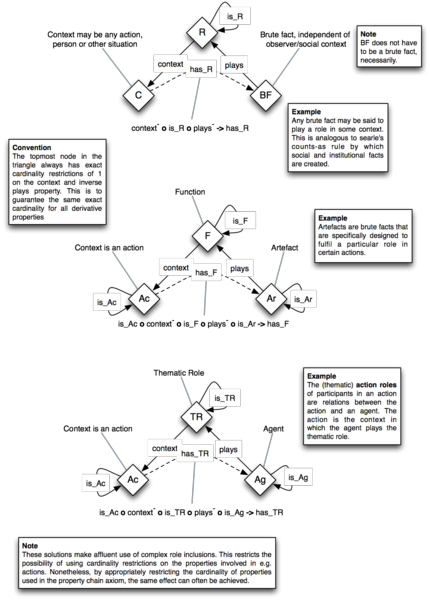

* [Image](../Image/Role.png.md#file)
* [File history](../Image/Role.png.md#filehistory)
* [Links](../Image/Role.png.md#filelinks)

  
Size of this preview: 430 × 600 pixels  
[Full resolution](../images/5/59/Role.png)‎ (1,141 × 1,591 pixel, file size: 370 KB, MIME type: image/png)Roles, functions, thematic roles (agent action role)

## File history

Click on a date/time to view the file as it appeared at that time.

  
* [Search for duplicate files](http://ontologydesignpatterns.org/wiki/Special:FileDuplicateSearch/Role.png "Special:FileDuplicateSearch/Role.png")
* [Edit this file using an external application](http://ontologydesignpatterns.org/wiki/index.php?title=Image:Role.png&action=edit&externaledit=true&mode=file "Image:Role.png")See the [setup instructions](http://www.mediawiki.org/wiki/Manual:External_editors "http://www.mediawiki.org/wiki/Manual:External_editors") for more information.

## Links

The following page links to this file:

* [Submissions:Roles (OWL 2)](../Submissions/Roles_(OWL_2).md).md).html "Submissions:Roles (OWL 2)")

Retrieved from "[http://ontologydesignpatterns.org/wiki/Image:Role.png](../Image/Role.png.md)"