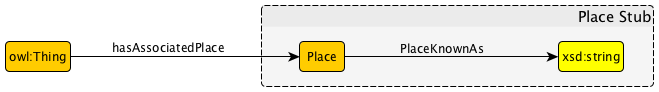

* [Image](../Image/Stub-metapattern-instantiationexample.png.md#file)
* [File history](../Image/Stub-metapattern-instantiationexample.png.md#filehistory)
* [Links](../Image/Stub-metapattern-instantiationexample.png.md#filelinks)

  
No higher resolution available.  
[Stub-metapattern-instantiationexample.png](../images/b/be/Stub-metapattern-instantiationexample.png)‎ (659 × 92 pixel, file size: 7 KB, MIME type: image/png)

## File history

Click on a date/time to view the file as it appeared at that time.

  
* [Search for duplicate files](http://ontologydesignpatterns.org/wiki/Special:FileDuplicateSearch/Stub-metapattern-instantiationexample.png "Special:FileDuplicateSearch/Stub-metapattern-instantiationexample.png")
* [Edit this file using an external application](http://ontologydesignpatterns.org/wiki/index.php?title=Image:Stub-metapattern-instantiationexample.png&action=edit&externaledit=true&mode=file "Image:Stub-metapattern-instantiationexample.png")See the [setup instructions](http://www.mediawiki.org/wiki/Manual:External_editors "http://www.mediawiki.org/wiki/Manual:External_editors") for more information.

## Links

The following page links to this file:

* [Submissions:Stub Metapattern](../Submissions/Stub_Metapattern.md "Submissions:Stub Metapattern")

Retrieved from "[http://ontologydesignpatterns.org/wiki/Image:Stub-metapattern-instantiationexample.png](../Image/Stub-metapattern-instantiationexample.png.md)"