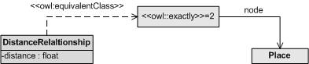

* [Image](../Image/Symmetric_n-ary_relationship_distance.jpg.md#file)
* [File history](../Image/Symmetric_n-ary_relationship_distance.jpg.md#filehistory)
* [Links](../Image/Symmetric_n-ary_relationship_distance.jpg.md#filelinks)

  
No higher resolution available.  
[Symmetric\_n-ary\_relationship\_distance.jpg](../images/b/bd/Symmetric_n-ary_relationship_distance.jpg)‎ (393 × 82 pixel, file size: 7 KB, MIME type: image/jpeg)

## File history

Click on a date/time to view the file as it appeared at that time.

  
* [Search for duplicate files](http://ontologydesignpatterns.org/wiki/Special:FileDuplicateSearch/Symmetric_n-ary_relationship_distance.jpg "Special:FileDuplicateSearch/Symmetric n-ary relationship distance.jpg")
* [Edit this file using an external application](http://ontologydesignpatterns.org/wiki/index.php?title=Image:Symmetric_n-ary_relationship_distance.jpg&action=edit&externaledit=true&mode=file "Image:Symmetric n-ary relationship distance.jpg")See the [setup instructions](http://www.mediawiki.org/wiki/Manual:External_editors "http://www.mediawiki.org/wiki/Manual:External_editors") for more information.

## Links

There are no pages that link to this file.

Retrieved from "[http://ontologydesignpatterns.org/wiki/Image:Symmetric\_n-ary\_relationship\_distance.jpg](../Image/Symmetric_n-ary_relationship_distance.jpg.md)"