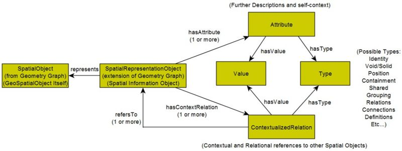

* [Image](../Image/USOcore3.jpg.md#file)
* [File history](../Image/USOcore3.jpg.md#filehistory)
* [Links](../Image/USOcore3.jpg.md#filelinks)

  
Size of this preview: 800 × 301 pixels  
[Full resolution](../../images/e/eb/USOcore3.jpg)‎ (1,117 × 420 pixel, file size: 76 KB, MIME type: image/jpeg)Paper Abstract: This research provides a data pattern that allows spatial relationships to be captured at a more granular and descriptive level than has been possible thus far. This pattern is hosted by a modular and extensible framework used for translating between different data formats without needing to change current schemas or work flows. The Spatial Graph Adapter Pattern is used as a modular adapter for Building Industry information leading to interoperability with OGC standards; additionally, the pattern and extensible proof of concept Linked Data Platform is demonstrated with a case study example for BIM data.

## File history

Click on a date/time to view the file as it appeared at that time.

  
* [Search for duplicate files](http://ontologydesignpatterns.org/wiki/Special:FileDuplicateSearch/USOcore3.jpg "Special:FileDuplicateSearch/USOcore3.jpg")
* [Edit this file using an external application](http://ontologydesignpatterns.org/wiki/index.php?title=Image:USOcore3.jpg&action=edit&externaledit=true&mode=file "Image:USOcore3.jpg")See the [setup instructions](http://www.mediawiki.org/wiki/Manual:External_editors "http://www.mediawiki.org/wiki/Manual:External_editors") for more information.

## Links

The following page links to this file:

* [Submissions:Spatial Graph Adapter (SGA)](../Submissions/Spatial_Graph_Adapter_(SGA).md).html "Submissions:Spatial Graph Adapter (SGA)")

Retrieved from "[http://ontologydesignpatterns.org/wiki/Image:USOcore3.jpg](../Image/USOcore3.jpg.md)"