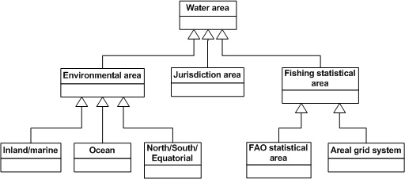

* [Image](../Image/WaterAreaOntology_1.png.md#file)
* [File history](../Image/WaterAreaOntology_1.png.md#filehistory)
* [Links](../Image/WaterAreaOntology_1.png.md#filelinks)

  
No higher resolution available.  
[WaterAreaOntology\_1.png](../images/a/a9/WaterAreaOntology_1.png)‎ (512 × 226 pixel, file size: 16 KB, MIME type: image/png)

## File history

Click on a date/time to view the file as it appeared at that time.

  
* [Search for duplicate files](http://ontologydesignpatterns.org/wiki/Special:FileDuplicateSearch/WaterAreaOntology_1.png "Special:FileDuplicateSearch/WaterAreaOntology 1.png")
* [Edit this file using an external application](http://ontologydesignpatterns.org/wiki/index.php?title=Image:WaterAreaOntology_1.png&action=edit&externaledit=true&mode=file "Image:WaterAreaOntology 1.png")See the [setup instructions](http://www.mediawiki.org/wiki/Manual:External_editors "http://www.mediawiki.org/wiki/Manual:External_editors") for more information.

## Links

The following page links to this file:

* [Submissions:Pattern for re-engineering a classification scheme, which follows the adjacency list data model, into an ontology schema](../Submissions/Pattern_for_re-engineering_a_classification_scheme,_which_follows_the_adjacency_list_data_model,_into_an_ontology_schema.md "Submissions:Pattern for re-engineering a classification scheme, which follows the adjacency list data model, into an ontology schema")

Retrieved from "[http://ontologydesignpatterns.org/wiki/Image:WaterAreaOntology\_1.png](../Image/WaterAreaOntology_1.png.md)"