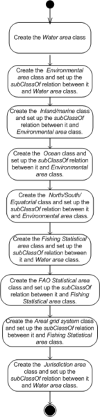

* [Image](../Image/Wfcsalsoexamplecheck.png.md#file)
* [File history](../Image/Wfcsalsoexamplecheck.png.md#filehistory)
* [Links](../Image/Wfcsalsoexamplecheck.png.md#filelinks)

  
Size of this preview: 144 × 598 pixels  
[Full resolution](../../images/5/5d/Wfcsalsoexamplecheck.png)‎ (185 × 768 pixel, file size: 32 KB, MIME type: image/png)

## File history

Click on a date/time to view the file as it appeared at that time.

  
* [Search for duplicate files](http://ontologydesignpatterns.org/wiki/Special:FileDuplicateSearch/Wfcsalsoexamplecheck.png "Special:FileDuplicateSearch/Wfcsalsoexamplecheck.png")
* [Edit this file using an external application](http://ontologydesignpatterns.org/wiki/index.php?title=Image:Wfcsalsoexamplecheck.png&action=edit&externaledit=true&mode=file "Image:Wfcsalsoexamplecheck.png")See the [setup instructions](http://www.mediawiki.org/wiki/Manual:External_editors "http://www.mediawiki.org/wiki/Manual:External_editors") for more information.

## Links

The following page links to this file:

* [Submissions:Classification scheme - adjacency list model - to Taxonomy](../Submissions/Classification_scheme_-_adjacency_list_model_-_to_Taxonomy.md "Submissions:Classification scheme - adjacency list model - to Taxonomy")

Retrieved from "[http://ontologydesignpatterns.org/wiki/Image:Wfcsalsoexamplecheck.png](../Image/Wfcsalsoexamplecheck.png.md)"