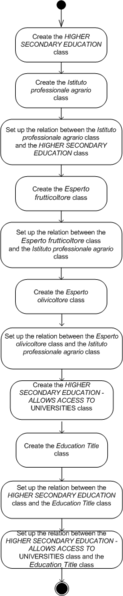

* [Image](../Image/Wfcsftsoexample.png.md#file)
* [File history](../Image/Wfcsftsoexample.png.md#filehistory)
* [Links](../Image/Wfcsftsoexample.png.md#filelinks)

  
Size of this preview: 123 × 596 pixels  
[Full resolution](../images/2/27/Wfcsftsoexample.png)‎ (203 × 984 pixel, file size: 36 KB, MIME type: image/png)

## File history

Click on a date/time to view the file as it appeared at that time.

  
* [Search for duplicate files](http://ontologydesignpatterns.org/wiki/Special:FileDuplicateSearch/Wfcsftsoexample.png "Special:FileDuplicateSearch/Wfcsftsoexample.png")
* [Edit this file using an external application](http://ontologydesignpatterns.org/wiki/index.php?title=Image:Wfcsftsoexample.png&action=edit&externaledit=true&mode=file "Image:Wfcsftsoexample.png")See the [setup instructions](http://www.mediawiki.org/wiki/Manual:External_editors "http://www.mediawiki.org/wiki/Manual:External_editors") for more information.

## Links

The following page links to this file:

* [Submissions:Pattern for re-engineering a classification scheme, which follows the flattened data model, into an ontology schema](../Submissions/Pattern_for_re-engineering_a_classification_scheme,_which_follows_the_flattened_data_model,_into_an_ontology_schema.md "Submissions:Pattern for re-engineering a classification scheme, which follows the flattened data model, into an ontology schema")

Retrieved from "[http://ontologydesignpatterns.org/wiki/Image:Wfcsftsoexample.png](../Image/Wfcsftsoexample.png.md)"