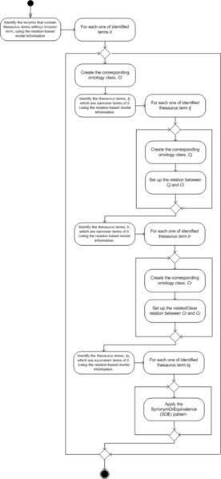

* [Image](../Image/Wftbthrello.png.md#file)
* [File history](../Image/Wftbthrello.png.md#filehistory)
* [Links](../Image/Wftbthrello.png.md#filelinks)

  
Size of this preview: 276 × 598 pixels  
[Full resolution](../../images/4/40/Wftbthrello.png)‎ (552 × 1,196 pixel, file size: 55 KB, MIME type: image/png)

## File history

Click on a date/time to view the file as it appeared at that time.

  
* [Search for duplicate files](http://ontologydesignpatterns.org/wiki/Special:FileDuplicateSearch/Wftbthrello.png "Special:FileDuplicateSearch/Wftbthrello.png")
* [Edit this file using an external application](http://ontologydesignpatterns.org/wiki/index.php?title=Image:Wftbthrello.png&action=edit&externaledit=true&mode=file "Image:Wftbthrello.png")See the [setup instructions](http://www.mediawiki.org/wiki/Manual:External_editors "http://www.mediawiki.org/wiki/Manual:External_editors") for more information.

## Links

The following page links to this file:

* [Submissions:Pattern for re-engineering a term-based thesaurus, which follows the relationbased data model, into an ontology schema](../Submissions/Pattern_for_re-engineering_a_term-based_thesaurus,_which_follows_the_relationbased_data_model,_into_an_ontology_schema.md "Submissions:Pattern for re-engineering a term-based thesaurus, which follows the relationbased data model, into an ontology schema")

Retrieved from "[http://ontologydesignpatterns.org/wiki/Image:Wftbthrello.png](../Image/Wftbthrello.png.md)"