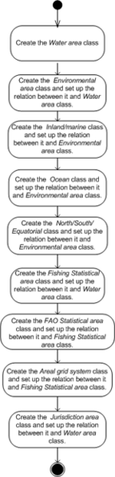

* [Image](../Image/Workflow_PR-NOR-CLTX-02_example.png#file)
* [File history](../Image/Workflow_PR-NOR-CLTX-02_example.png#filehistory)
* [Links](../Image/Workflow_PR-NOR-CLTX-02_example.png#filelinks)

  
Size of this preview: 144 × 598 pixels  
[Full resolution](../images/9/9e/Workflow_PR-NOR-CLTX-02_example.png)‎ (150 × 623 pixel, file size: 64 KB, MIME type: image/png)

## File history

Click on a date/time to view the file as it appeared at that time.

  
* [Search for duplicate files](http://ontologydesignpatterns.org/wiki/Special:FileDuplicateSearch/Workflow_PR-NOR-CLTX-02_example.png "Special:FileDuplicateSearch/Workflow PR-NOR-CLTX-02 example.png")
* [Edit this file using an external application](http://ontologydesignpatterns.org/wiki/index.php?title=Image:Workflow_PR-NOR-CLTX-02_example.png&action=edit&externaledit=true&mode=file "Image:Workflow PR-NOR-CLTX-02 example.png")See the [setup instructions](http://www.mediawiki.org/wiki/Manual:External_editors "http://www.mediawiki.org/wiki/Manual:External_editors") for more information.

## Links

The following page links to this file:

* [Submissions:Pattern for re-engineering a classification scheme, which follows the adjacency list data model, into an ontology schema](../Submissions/Pattern_for_re-engineering_a_classification_scheme,_which_follows_the_adjacency_list_data_model,_into_an_ontology_schema "Submissions:Pattern for re-engineering a classification scheme, which follows the adjacency list data model, into an ontology schema")

Retrieved from "[http://ontologydesignpatterns.org/wiki/Image:Workflow\_PR-NOR-CLTX-02\_example.png](../Image/Workflow_PR-NOR-CLTX-02_example.png)"