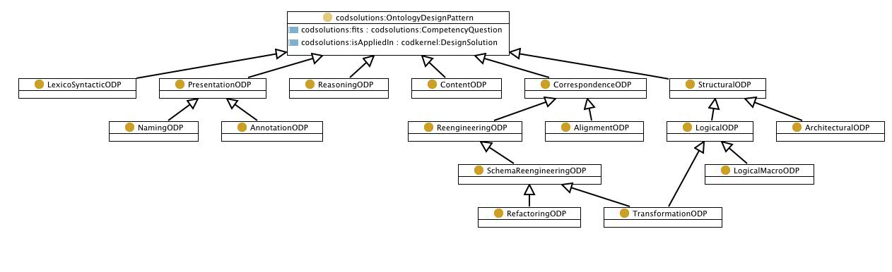

__Ontology Design Pattern types__

There are several types of ODPs.

  

We have identified several types of ODPs, and have 
grouped them into six families as shown in the figure below.

* [Structural ODPs](Category/StructuralOP.md "Category:StructuralOP")
	+ [Logical ODPs](Category/LogicalOP.md "Category:LogicalOP")
	+ [Architectural ODPs](Category/ArchitecturalOP.md "Category:ArchitecturalOP")
* [Correspondence ODPs](Category/CorrespondenceOP.md "Category:CorrespondenceOP")
	+ [Re-engineering ODPs](Category/ReengineeringOP.md "Category:ReengineeringOP")
	+ [Alignment ODPs](Category/AlignmentOP.md "Category:AlignmentOP")
* [Content ODPs (CPs)](Category/ContentOP.md "Category:ContentOP")
* [Reasoning ODPs](Category/ReasoningOP.md "Category:ReasoningOP")
* [Presentation ODPs](Category/PresentationOP.md "Category:PresentationOP") 
	+ [Naming ODPs](Category/NamingOP.md "Category:NamingOP")
	+ [Annotation ODPs](Category/AnnotationOP.md "Category:AnnotationOP")
* [Lexico-Syntactic ODPs](Category/LexicoSyntacticOP.md "Category:LexicoSyntacticOP")

  

__Diagram__

Retrieved from "[http://ontologydesignpatterns.org/wiki/OPTypes](OPTypes.md)"