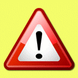

##  Tests and Examples


###  Testing my watchlist


```
this text was added to make the page change so I can test if the system  sends me an e-mail now that is changed

```

###  Testing www and non-www url


These two links are equivalent: [with www](http://ontologydesignpatterns.org/index.php/Odp:Development "http://ontologydesignpatterns.org/index.php/Odp:Development") , [without www](http://ontologydesignpatterns.org/index.php/Odp:Development "http://ontologydesignpatterns.org/index.php/Odp:Development")


###  Testing UrlGetParameter extension


```

{{#urlget:paramname|default}}

```

Try adding param=value to the current URL.


Value is: no param


###  Testing RightFunctions extension


```

{{#ifright:right|then|else}}

```


```

{{#ifallowed:user|right|then|else}}

```


```

{{#switchright:right1=result1|right2|right3=result2 and 3|right4=result4|default (or #default=default if the default text contains =)}}

```


```

{{#userrights:}} (for current user) or {{#userrights:user}}

```


```

'''Warning!''' do not use it.
{{#usergroup:}} (for current user) or {{#usergroup:user}}

```


```

 {{#ifgroup:group|then|else}} (for current user) or {{#ifgroup:group|then|else|user}} (for other users)

```


```

{{#switchgroup:group1=result1|group2|group3=result2 and 3|group4=result4|default (or #default=default if the default text contains =)}}

```


```

{{#ifpageright:right|then|else|page}} for testing other pages or {{#ifpageright:right|then|else}} for testing the current page.

```


```

{{#ifpageallowed:user|right|then|else|page}} for testing other pages or {{#ifpageallowed:user|right|then|else}} for testing the current page.

```


```

{{#ifprotected:then|else|page}} for testing other pages, or {{#ifprotected:then|else}} for testing the current page or (for example) {{#ifprotected:then|else|page|fns}} for testing only certain types of protection.

```


```

{{#getrestrictions:right|page}} for testing other pages, or {{#getrestrictions:right}} for testing the current page or {{#getrestrictions:right|page|true}} for listing all restrictions instead of just the highest one.

```


```


```

###  Testing ImageMap extension


Details about this extension can be found [here](http://www.mediawiki.org/wiki/Extension:ImageMap "http://www.mediawiki.org/wiki/Extension:ImageMap").


ImageMap extension is installed. ~~BUT IT DOES NOT WORK ALREADY~~


  


[](../../Image/Warning.gif "About this image")
###  Testing Variables extension


Details about this extension can be found [here](http://www.mediawiki.org/wiki/Extension:Variables "http://www.mediawiki.org/wiki/Extension:Variables")


Syntax:


```

{{#vardefine:A|value of A}}
{{#vardefine:B|1000}}
Value of A is '''{{#var:A}}''' and value of B is '''{{#var:B}}'''

```

Result:


  

Value of A is __value of A__ and value of B is __1000__


###  Testing template [Definition](../../Template/Definition "Template:Definition")


[](../../Image/Definition.gif "Definition.gif")
__Title of definition__

Of example:
* bullett list of
* items


We test if the second paramenter of the _template_ allows use of wikitext.


  


###  Testing smw ask query for tasks


Retrieved from "[http://ontologydesignpatterns.org/wiki/Odp:Development/Tests](../../Odp/Development/Tests)"