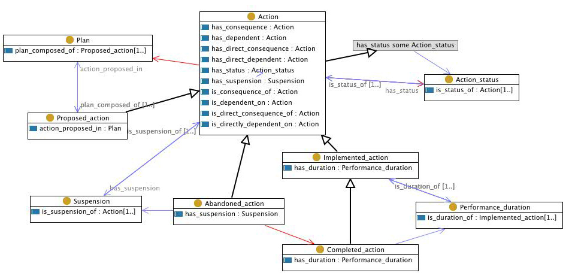

 __This pattern has been certified.__
Related submission, with evaluation history, can be found __here__

#  Graphical representation

__Diagram__

#  General description

  

#  Elements

_The __Action__ Content OP locally defines the following ontology elements:_

 __Action__ (owl:Class) The process of doing something. An action is performed by an agent. An action can be proposed (proposed actions make up a plan), implemented or abandoned, and it has a status and possibly one or more suspension periods. Actions can have consequences and can be dependent on other actions, e.g. the action of pouring water from a cup is dependent on the action to first fill the cup with water. 
  _[Action](../Submissions/Action/Action.md "Submissions:Action/Action") page_
 __Action\_status__ (owl:Class) The different values the status of an action can take. A possible set of status values could be {proposed, ongoing, completed, abandoned}. 
  _[Action\_status](../Submissions/Action/Action_status.md "Submissions:Action/Action status") page_
 __has\_status__ (owl:ObjectProperty) A property that can be used to relate an action instance to its current status. For example, we could represent the fact that "I finished making coffee". 
  _[has\_status](../Submissions/Action/has_status.md "Submissions:Action/has status") page_
 __is\_consequence\_of__ (owl:TransitiveProperty) A causal relation between actions, i.e. one action is the cause of another action. For example, the action of "swimming" is a consequence of "jumping into deep water". 
  _[is\_consequence\_of](../Submissions/Action/is_consequence_of.md "Submissions:Action/is consequence of") page_
 __is\_dependent\_on__ (owl:TransitiveProperty) A transitive property for representing other types of dependencies between actions (other than the consequence one). For example, "swimming" is dependent on the action "getting into the water", but it is not necessarily a consequence (we may be able to also walk if the water is shallow). 
  _[is\_dependent\_on](../Submissions/Action/is_dependent_on.md "Submissions:Action/is dependent on") page_
 __Plan__ (owl:Class) A set of proposed actions and the sequence in which to perform them. 
  _[Plan](../Submissions/Action/Plan.md "Submissions:Action/Plan") page_
 __Suspension__ (owl:Class) The time interval within which an action is (temporarily or permanently) suspended. 
  _[Suspension](../Submissions/Action/Suspension.md "Submissions:Action/Suspension") page_
 __has\_suspension__ (owl:ObjectProperty) Property that can be used to relate an action instance to periods of suspension of that action. For example, we could represent that I took a lunch break between 1 and 2pm while preparing slides for a particular lecture. 
  _[has\_suspension](../Submissions/Action/has_suspension.md "Submissions:Action/has suspension") page_
 __Performance\_duration__ (owl:Class) The time interval within which an action is performed. 
  _[Performance\_duration](../Submissions/Action/Performance_duration.md "Submissions:Action/Performance duration") page_
 __is\_duration\_of__ (owl:ObjectProperty) Property relating a time interval (a duration) to implemented actions, representing their execution time. For example, the property could be used to represent the fact that I started to make coffee at 9am this morning and finished 5 minutes later. 
  _[is\_duration\_of](../Submissions/Action/is_duration_of.md "Submissions:Action/is duration of") page_
 __Implemented\_action__ (owl:Class) An implemented action is an action that has been started. 
  _[Implemented\_action](http://ontologydesignpatterns.org/wiki/Submissions:Action/Implemented_action "Submissions:Action/Implemented action") page_
 __is\_suspension\_of__ (owl:ObjectProperty) Property that can be used to relate a suspension period of suspension to an action. For example, we could represent that I took a lunch break between 1 and 2pm while preparing slides for a particular lecture. 
  _[is\_suspension\_of](../Submissions/Action/is_suspension_of.md "Submissions:Action/is suspension of") page_
 __plan\_composed\_of__ (owl:ObjectProperty) Property relating a plan to the action(s) (proposed action) that it contains. For example, the plan for making coffee contains the actions "filling up the water container", "adding coffee", and "turning on the coffee machine". 
  _[plan\_composed\_of](../Submissions/Action/plan_composed_of.md "Submissions:Action/plan composed of") page_
 __Proposed\_action__ (owl:Class) A proposed action is an action that is in some plan, whether the plan is accepted or shared between agents or not. Proposed actions can be abandoned or implemented. 
  _[Proposed\_action](http://ontologydesignpatterns.org/wiki/Submissions:Action/Proposed_action "Submissions:Action/Proposed action") page_
 __is\_status\_of__ (owl:ObjectProperty) A property that can be used to relate a status to instances of actions. For example, we could represent the fact that "I finished making coffee". 
  _[is\_status\_of](../Submissions/Action/is_status_of.md "Submissions:Action/is status of") page_
 __Abandoned\_action__ (owl:Class) An abandoned action is an action which is no longer going to be performed, regardless if it was previously just proposed or actually partly implemented. An abandoned action could be seen as an action that is permanently suspended. 
  _[Abandoned\_action](http://ontologydesignpatterns.org/wiki/Submissions:Action/Abandoned_action "Submissions:Action/Abandoned action") page_
 __Completed\_action__ (owl:Class) A completed action is an implemented action that has also been finalized. 
  _[Completed\_action](http://ontologydesignpatterns.org/wiki/Submissions:Action/Completed_action "Submissions:Action/Completed action") page_
 __has\_duration__ (owl:ObjectProperty) Property relating implemented actions (actions that have been started) to their duration, which is a (possibly open-ended) time interval. For example, the property could be used to represent the fact that I started to make coffee at 9am this morning and finished 5 minutes later. 
  _[has\_duration](../Submissions/Action/has_duration.md "Submissions:Action/has duration") page_
 __action\_proposed\_in__ (owl:ObjectProperty) Property relating an action (proposed action) to the plan(s) in which it is contained. For example, the plan for making coffee contains the actions "filling up the water container", "adding coffee", and "turning on the coffee machine". 
  _[action\_proposed\_in](http://ontologydesignpatterns.org/wiki/Submissions:Action/action_proposed_in "Submissions:Action/action proposed in") page_
 __has\_direct\_consequence__ (owl:ObjectProperty) An intransitive subproperty of the causal consequence property, for representing direct consequences. 
  _[has\_direct\_consequence](../Submissions/Action/has_direct_consequence.md "Submissions:Action/has direct consequence") page_
 __has\_consequence__ (owl:TransitiveProperty) A causal relation between actions, i.e. one action is the cause of another action. For example, the action of "swimming" is a consequence of "jumping into deep water". The property is transitive. 
  _[has\_consequence](../Submissions/Action/has_consequence.md "Submissions:Action/has consequence") page_
 __is\_direct\_consequence\_of__ (owl:ObjectProperty) An intransitive subproperty of the causal consequence property, for representing direct consequences. 
  _[is\_direct\_consequence\_of](../Submissions/Action/is_direct_consequence_of.md "Submissions:Action/is direct consequence of") page_
 __is\_directly\_dependent\_on__ (owl:TransitiveProperty) Intransitive version of the dependency property, for representing direct dependency relations. 
  _[is\_directly\_dependent\_on](../Submissions/Action/is_directly_dependent_on.md "Submissions:Action/is directly dependent on") page_
 __has\_direct\_dependent__ (owl:TransitiveProperty) Intransitive version of the dependency property, for representing direct dependency relations. 
  _[has\_direct\_dependent](../Submissions/Action/has_direct_dependent.md "Submissions:Action/has direct dependent") page_
 __has\_dependent__ (owl:TransitiveProperty) A transitive property for representing other types of dependencies between actions (other than the consequence one). For example, "swimming" is dependent on the action "getting into the water", but it is not necessarily a consequence (we may be able to also walk if the water is shallow). 
  _[has\_dependent](../Submissions/Action/has_dependent.md "Submissions:Action/has dependent") page_
#  Additional information

#  Scenarios

__Scenarios about Action__
No scenario is added to this Content OP.

#  Reviews

__Reviews about Action__
There is no review about this proposal.
This revision (revision ID __9806__) takes in account the reviews: none

Other info at [evaluation tab](http://ontologydesignpatterns.org/wiki/index.php?title=Submissions:Action&action=evaluation "http://ontologydesignpatterns.org/wiki/index.php?title=Submissions:Action&action=evaluation")

  

#  Modeling issues

__Modeling issues about Action__
There is no Modeling issue related to this proposal.

  

#  References

[Add a reference](index.php@title=Odp%253AAdd_reference&subject=../Submissions/Action.md "http://ontologydesignpatterns.org/wiki/index.php?title=Odp:Add_reference&subject=Submissions%3AAction")

  

Retrieved from "[http://ontologydesignpatterns.org/wiki/Submissions:Action](../Submissions/Action.md)"
 [Category](http://ontologydesignpatterns.org/wiki/Special:Categories "Special:Categories"): [ProposedContentOP](../Category/ProposedContentOP.md "Category:ProposedContentOP")