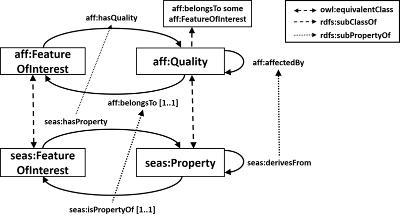

 __This pattern has been certified.__
Related submission, with evaluation history, can be found __here__

#  Graphical representation

__Diagram__
_(this article has no graphical representation)_

#  General description

  

#  Elements

_The __AffectedBy__ Content OP locally defines the following ontology elements:_

 __FeatureOfInterest__ (owl:Class) A feature of interest is an abstraction of a real world phenomena (object, event, etc). A feature of interest is then described in terms of its properties or qualities, which are qualifiable, quantifiable, observable or operable qualities of the feature of interest. 
  _[FeatureOfInterest](../Submissions/AffectedBy/FeatureOfInterest.md "Submissions:AffectedBy/FeatureOfInterest") page_
 __Quality__ (owl:Class) A quality of a feature of interest. An aspect of a feature of interest that is intrinsec to and cannot exist without the feature of interest. Every quality belongs to the feature of interest it is intrinsic to. 
  _[Quality](../Submissions/AffectedBy/Quality.md "Submissions:AffectedBy/Quality") page_
 __affectedBy__ (owl:ObjectProperty) A relation between qualities. A quality is affected by another quality if the value of the latter affects the value of the former. 
  _[affectedBy](../Submissions/AffectedBy/affectedBy.md "Submissions:AffectedBy/affectedBy") page_
 __belongsTo__ (owl:ObjectProperty) A relation between qualities and features of interest. Every quality belongs to the feature of interest it is intrinsic to. 
  _[belongsTo](../Submissions/AffectedBy/belongsTo.md "Submissions:AffectedBy/belongsTo") page_
[Submissions:AffectedBy/influencedBy](http://ontologydesignpatterns.org/wiki/Special:AddData/Ontology Element Form/Submissions:AffectedBy/influencedBy "Submissions:AffectedBy/influencedBy (not yet written)")  _[influencedBy](http://ontologydesignpatterns.org/wiki/Special:AddData/Ontology Element Form/Submissions:AffectedBy/influencedBy "Submissions:AffectedBy/influencedBy (not yet written)") page_
#  Additional information

Insert non-formatted text here

#  Scenarios

__Scenarios about AffectedBy__
No scenario is added to this Content OP.

#  Reviews

__Reviews about AffectedBy__
There is no review about this proposal.
This revision (revision ID __13592__) takes in account the reviews: none

Other info at [evaluation tab](http://ontologydesignpatterns.org/wiki/index.php?title=Submissions:AffectedBy&action=evaluation "http://ontologydesignpatterns.org/wiki/index.php?title=Submissions:AffectedBy&action=evaluation")

  

#  Modeling issues

__Modeling issues about AffectedBy__
There is no Modeling issue related to this proposal.

  

#  References

[Add a reference](index.php@title=Odp%253AAdd_reference&subject=../Submissions/AffectedBy.md "http://ontologydesignpatterns.org/wiki/index.php?title=Odp:Add_reference&subject=Submissions%3AAffectedBy")

  

Retrieved from "[http://ontologydesignpatterns.org/wiki/Submissions:AffectedBy](../Submissions/AffectedBy.md)"
 [Categories](http://ontologydesignpatterns.org/wiki/Special:Categories "Special:Categories"): [ProposedContentOP](../Category/ProposedContentOP.md "Category:ProposedContentOP") | [Submitted to event](../Category/Submitted_to_event.md "Category:Submitted to event")