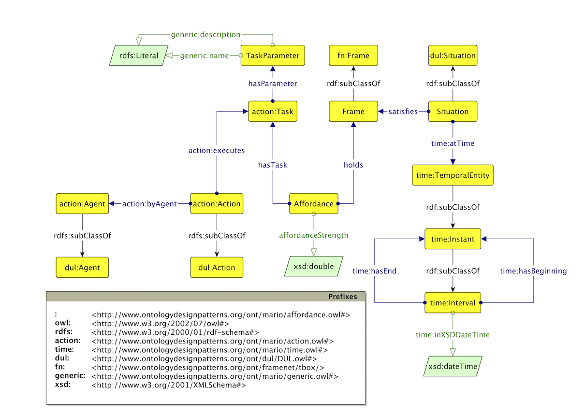

 __This pattern has been certified.__
Related submission, with evaluation history, can be found __here__

#  Graphical representation

__Diagram__

#  General description

  

#  Elements

_The __Affordance__ Content OP locally defines the following ontology elements:_

 __hasParameter__ (owl:ObjectProperty) It associates the Task with its parameters. 
  _[hasParameter](../Submissions/Affordance/hasParameter.md "Submissions:Affordance/hasParameter") page_
 __hasTask__ (owl:ObjectProperty) It associates an Affordance to the Task it refers to. 
  _[hasTask](../Submissions/Affordance/hasTask.md "Submissions:Affordance/hasTask") page_
 __holds__ (owl:ObjectProperty) It associates an Affordance with the Frame in which it holds. 
  _[holds](../Submissions/Affordance/holds.md "Submissions:Affordance/holds") page_
 __isHeldBy__ (owl:ObjectProperty) It associates a Frame with the Affordance it enables. 
  _[isHeldBy](../Submissions/Affordance/isHeldBy.md "Submissions:Affordance/isHeldBy") page_
 __affordanceStrength__ (owl:DatatypeProperty) It encodes the strength of the Affordance. 
  _[affordanceStrength](../Submissions/Affordance/affordanceStrength.md "Submissions:Affordance/affordanceStrength") page_
 __Affordance__ (owl:Class) An affordance is modelled in DnS fashion and is an n-ary that relates state of the world (i.e., situations) to tasks according to specific weights or affordance strengths. 
  _[Affordance](../Submissions/Affordance/Affordance.md "Submissions:Affordance/Affordance") page_
 __Frame__ (owl:Class) 
  _[Frame](../Submissions/Affordance/Frame.md "Submissions:Affordance/Frame") page_
 __Situation__ (owl:Class) A state of the world. 
  _[Situation](../Submissions/Affordance/Situation.md "Submissions:Affordance/Situation") page_
 __TaskParameter__ (owl:Class) A parameter of a task. 
  _[TaskParameter](../Submissions/Affordance/TaskParameter.md "Submissions:Affordance/TaskParameter") page_
#  Additional information

#  Scenarios

__Scenarios about Affordance__
No scenario is added to this Content OP.

#  Reviews

__Reviews about Affordance__
There is no review about this proposal.
This revision (revision ID __12749__) takes in account the reviews: none

Other info at [evaluation tab](http://ontologydesignpatterns.org/wiki/index.php?title=Submissions:Affordance&action=evaluation "http://ontologydesignpatterns.org/wiki/index.php?title=Submissions:Affordance&action=evaluation")

  

#  Modeling issues

__Modeling issues about Affordance__
There is no Modeling issue related to this proposal.

  

#  References

[Add a reference](index.php@title=Odp%253AAdd_reference&subject=../Submissions/Affordance.md "http://ontologydesignpatterns.org/wiki/index.php?title=Odp:Add_reference&subject=Submissions%3AAffordance")

  

Retrieved from "[http://ontologydesignpatterns.org/wiki/Submissions:Affordance](../Submissions/Affordance.md)"
 [Category](http://ontologydesignpatterns.org/wiki/Special:Categories "Special:Categories"): [ProposedContentOP](../Category/ProposedContentOP.md "Category:ProposedContentOP")