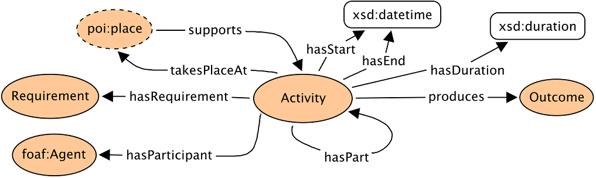

 __This pattern has been certified.__
Related submission, with evaluation history, can be found __here__

#  Graphical representation

__Diagram__

#  General description

  

#  Elements

_The __An Ontology Design Pattern for Activity Reasoning__ Content OP locally defines the following ontology elements:_

 __hasDependent__ (owl:ObjectProperty) 
  _[hasDependent](../Submissions/An_Ontology_Design_Pattern_for_Activity_Reasoning/hasDependent.md "Submissions:An Ontology Design Pattern for Activity Reasoning/hasDependent") page_
 __hasOutcome__ (owl:ObjectProperty) 
  _[hasOutcome](../Submissions/An_Ontology_Design_Pattern_for_Activity_Reasoning/hasOutcome.md "Submissions:An Ontology Design Pattern for Activity Reasoning/hasOutcome") page_
 __hasPart__ (owl:ObjectProperty) 
  _[hasPart](../Submissions/An_Ontology_Design_Pattern_for_Activity_Reasoning/hasPart.md "Submissions:An Ontology Design Pattern for Activity Reasoning/hasPart") page_
 __hasParticipant__ (owl:ObjectProperty) 
  _[hasParticipant](../Submissions/An_Ontology_Design_Pattern_for_Activity_Reasoning/hasParticipant.md "Submissions:An Ontology Design Pattern for Activity Reasoning/hasParticipant") page_
 __hasRequirement__ (owl:ObjectProperty) 
  _[hasRequirement](../Submissions/An_Ontology_Design_Pattern_for_Activity_Reasoning/hasRequirement.md "Submissions:An Ontology Design Pattern for Activity Reasoning/hasRequirement") page_
 __isDependentOf__ (owl:ObjectProperty) 
  _[isDependentOf](../Submissions/An_Ontology_Design_Pattern_for_Activity_Reasoning/isDependentOf.md "Submissions:An Ontology Design Pattern for Activity Reasoning/isDependentOf") page_
 __isPartOf__ (owl:ObjectProperty) 
  _[isPartOf](../Submissions/An_Ontology_Design_Pattern_for_Activity_Reasoning/isPartOf.md "Submissions:An Ontology Design Pattern for Activity Reasoning/isPartOf") page_
 __isPrecededBy__ (owl:ObjectProperty) 
  _[isPrecededBy](../Submissions/An_Ontology_Design_Pattern_for_Activity_Reasoning/isPrecededBy.md "Submissions:An Ontology Design Pattern for Activity Reasoning/isPrecededBy") page_
 __isRequirementOf__ (owl:ObjectProperty) 
  _[isRequirementOf](../Submissions/An_Ontology_Design_Pattern_for_Activity_Reasoning/isRequirementOf.md "Submissions:An Ontology Design Pattern for Activity Reasoning/isRequirementOf") page_
 __precedes__ (owl:ObjectProperty) 
  _[precedes](../Submissions/An_Ontology_Design_Pattern_for_Activity_Reasoning/precedes.md "Submissions:An Ontology Design Pattern for Activity Reasoning/precedes") page_
 __produces__ (owl:ObjectProperty) 
  _[produces](../Submissions/An_Ontology_Design_Pattern_for_Activity_Reasoning/produces.md "Submissions:An Ontology Design Pattern for Activity Reasoning/produces") page_
 __supports__ (owl:ObjectProperty) 
  _[supports](../Submissions/An_Ontology_Design_Pattern_for_Activity_Reasoning/supports.md "Submissions:An Ontology Design Pattern for Activity Reasoning/supports") page_
 __takesPlaceAt__ (owl:ObjectProperty) 
  _[takesPlaceAt](../Submissions/An_Ontology_Design_Pattern_for_Activity_Reasoning/takesPlaceAt.md "Submissions:An Ontology Design Pattern for Activity Reasoning/takesPlaceAt") page_
 __hasDuration__ (owl:DatatypeProperty) 
  _[hasDuration](../Submissions/An_Ontology_Design_Pattern_for_Activity_Reasoning/hasDuration.md "Submissions:An Ontology Design Pattern for Activity Reasoning/hasDuration") page_
 __hasEnd__ (owl:DatatypeProperty) 
  _[hasEnd](../Submissions/An_Ontology_Design_Pattern_for_Activity_Reasoning/hasEnd.md "Submissions:An Ontology Design Pattern for Activity Reasoning/hasEnd") page_
 __hasStart__ (owl:DatatypeProperty) 
  _[hasStart](../Submissions/An_Ontology_Design_Pattern_for_Activity_Reasoning/hasStart.md "Submissions:An Ontology Design Pattern for Activity Reasoning/hasStart") page_
 __Activity__ (owl:Class) 
  _[Activity](../Submissions/An_Ontology_Design_Pattern_for_Activity_Reasoning/Activity.md "Submissions:An Ontology Design Pattern for Activity Reasoning/Activity") page_
 __FixedActivity__ (owl:Class) 
  _[FixedActivity](../Submissions/An_Ontology_Design_Pattern_for_Activity_Reasoning/FixedActivity.md "Submissions:An Ontology Design Pattern for Activity Reasoning/FixedActivity") page_
 __FlexibleActivity__ (owl:Class) 
  _[FlexibleActivity](../Submissions/An_Ontology_Design_Pattern_for_Activity_Reasoning/FlexibleActivity.md "Submissions:An Ontology Design Pattern for Activity Reasoning/FlexibleActivity") page_
 __Outcome__ (owl:Class) 
  _[Outcome](../Submissions/An_Ontology_Design_Pattern_for_Activity_Reasoning/Outcome.md "Submissions:An Ontology Design Pattern for Activity Reasoning/Outcome") page_
 __Place__ (owl:Class) 
  _[Place](../Submissions/An_Ontology_Design_Pattern_for_Activity_Reasoning/Place.md "Submissions:An Ontology Design Pattern for Activity Reasoning/Place") page_
 __Requirement__ (owl:Class) 
  _[Requirement](../Submissions/An_Ontology_Design_Pattern_for_Activity_Reasoning/Requirement.md "Submissions:An Ontology Design Pattern for Activity Reasoning/Requirement") page_
#  Additional information

While this pattern so far focuses on human activities, the agents that are involved in this pattern may also be other autonomous agents, such as animals.

#  Scenarios

__Scenarios about An Ontology Design Pattern for Activity Reasoning__
No scenario is added to this Content OP.

#  Reviews

__Reviews about An Ontology Design Pattern for Activity Reasoning__
There is no review about this proposal.
This revision (revision ID __12001__) takes in account the reviews: none

Other info at [evaluation tab](http://ontologydesignpatterns.org/wiki/index.php?title=Submissions:An_Ontology_Design_Pattern_for_Activity_Reasoning&action=evaluation "http://ontologydesignpatterns.org/wiki/index.php?title=Submissions:An_Ontology_Design_Pattern_for_Activity_Reasoning&action=evaluation")

  

#  Modeling issues

__Modeling issues about An Ontology Design Pattern for Activity Reasoning__
There is no Modeling issue related to this proposal.

  

#  References

[Add a reference](index.php@title=Odp%253AAdd_reference&subject=Submissions%253AAn+Ontology+Design+Pattern+for+Activity+Reasoning.html "http://ontologydesignpatterns.org/wiki/index.php?title=Odp:Add_reference&subject=Submissions%3AAn+Ontology+Design+Pattern+for+Activity+Reasoning")

  

Retrieved from "[http://ontologydesignpatterns.org/wiki/Submissions:An\_Ontology\_Design\_Pattern\_for\_Activity\_Reasoning](../Submissions/An_Ontology_Design_Pattern_for_Activity_Reasoning.md)"
 [Category](http://ontologydesignpatterns.org/wiki/Special:Categories "Special:Categories"): [ProposedContentOP](../Category/ProposedContentOP.md "Category:ProposedContentOP")