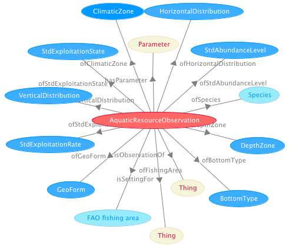

 __This pattern has been certified.__
Related submission, with evaluation history, can be found __here__

#  Graphical representation

__Diagram__

#  General description

  

#  Elements

_The __AquaticResourceObservation__ Content OP locally defines the following ontology elements:_

 __bottomTypeOfObservation__ (owl:ObjectProperty) 
  _[bottomTypeOfObservation](../Submissions/AquaticResourceObservation/bottomTypeOfObservation.md "Submissions:AquaticResourceObservation/bottomTypeOfObservation") page_
 __climaticZoneOfObservation__ (owl:ObjectProperty) 
  _[climaticZoneOfObservation](../Submissions/AquaticResourceObservation/climaticZoneOfObservation.md "Submissions:AquaticResourceObservation/climaticZoneOfObservation") page_
 __depthZoneOfObservation__ (owl:ObjectProperty) 
  _[depthZoneOfObservation](../Submissions/AquaticResourceObservation/depthZoneOfObservation.md "Submissions:AquaticResourceObservation/depthZoneOfObservation") page_
 __fishingAreaOfObservation__ (owl:ObjectProperty) 
  _[fishingAreaOfObservation](../Submissions/AquaticResourceObservation/fishingAreaOfObservation.md "Submissions:AquaticResourceObservation/fishingAreaOfObservation") page_
 __geoFormOfObservation__ (owl:ObjectProperty) 
  _[geoFormOfObservation](../Submissions/AquaticResourceObservation/geoFormOfObservation.md "Submissions:AquaticResourceObservation/geoFormOfObservation") page_
 __horizontalDistributionOfObservation__ (owl:ObjectProperty) 
  _[horizontalDistributionOfObservation](../Submissions/AquaticResourceObservation/horizontalDistributionOfObservation.md "Submissions:AquaticResourceObservation/horizontalDistributionOfObservation") page_
 __ofBottomType__ (owl:ObjectProperty) 
  _[ofBottomType](../Submissions/AquaticResourceObservation/ofBottomType.md "Submissions:AquaticResourceObservation/ofBottomType") page_
 __ofClimaticZone__ (owl:ObjectProperty) 
  _[ofClimaticZone](../Submissions/AquaticResourceObservation/ofClimaticZone.md "Submissions:AquaticResourceObservation/ofClimaticZone") page_
 __ofDepthZone__ (owl:ObjectProperty) 
  _[ofDepthZone](../Submissions/AquaticResourceObservation/ofDepthZone.md "Submissions:AquaticResourceObservation/ofDepthZone") page_
 __ofFishingArea__ (owl:ObjectProperty) 
  _[ofFishingArea](../Submissions/AquaticResourceObservation/ofFishingArea.md "Submissions:AquaticResourceObservation/ofFishingArea") page_
 __ofGeoForm__ (owl:ObjectProperty) 
  _[ofGeoForm](../Submissions/AquaticResourceObservation/ofGeoForm.md "Submissions:AquaticResourceObservation/ofGeoForm") page_
 __ofHorizontalDistribution__ (owl:ObjectProperty) 
  _[ofHorizontalDistribution](../Submissions/AquaticResourceObservation/ofHorizontalDistribution.md "Submissions:AquaticResourceObservation/ofHorizontalDistribution") page_
 __ofSpecies__ (owl:ObjectProperty) 
  _[ofSpecies](../Submissions/AquaticResourceObservation/ofSpecies.md "Submissions:AquaticResourceObservation/ofSpecies") page_
 __ofStdAbundanceLevel__ (owl:ObjectProperty) 
  _[ofStdAbundanceLevel](../Submissions/AquaticResourceObservation/ofStdAbundanceLevel.md "Submissions:AquaticResourceObservation/ofStdAbundanceLevel") page_
 __ofStdExploitationRate__ (owl:ObjectProperty) 
  _[ofStdExploitationRate](../Submissions/AquaticResourceObservation/ofStdExploitationRate.md "Submissions:AquaticResourceObservation/ofStdExploitationRate") page_
 __ofStdExploitationState__ (owl:ObjectProperty) 
  _[ofStdExploitationState](../Submissions/AquaticResourceObservation/ofStdExploitationState.md "Submissions:AquaticResourceObservation/ofStdExploitationState") page_
 __ofVerticalDistribution__ (owl:ObjectProperty) 
  _[ofVerticalDistribution](../Submissions/AquaticResourceObservation/ofVerticalDistribution.md "Submissions:AquaticResourceObservation/ofVerticalDistribution") page_
 __speciesFromObservation__ (owl:ObjectProperty) 
  _[speciesFromObservation](../Submissions/AquaticResourceObservation/speciesFromObservation.md "Submissions:AquaticResourceObservation/speciesFromObservation") page_
 __stdAbundanceLevelOfObservation__ (owl:ObjectProperty) 
  _[stdAbundanceLevelOfObservation](../Submissions/AquaticResourceObservation/stdAbundanceLevelOfObservation.md "Submissions:AquaticResourceObservation/stdAbundanceLevelOfObservation") page_
 __stdExploitationRateOfObservation__ (owl:ObjectProperty) 
  _[stdExploitationRateOfObservation](../Submissions/AquaticResourceObservation/stdExploitationRateOfObservation.md "Submissions:AquaticResourceObservation/stdExploitationRateOfObservation") page_
 __stdExploitationStateOfObservation__ (owl:ObjectProperty) 
  _[stdExploitationStateOfObservation](../Submissions/AquaticResourceObservation/stdExploitationStateOfObservation.md "Submissions:AquaticResourceObservation/stdExploitationStateOfObservation") page_
 __verticalDistributionOfObservation__ (owl:ObjectProperty) 
  _[verticalDistributionOfObservation](../Submissions/AquaticResourceObservation/verticalDistributionOfObservation.md "Submissions:AquaticResourceObservation/verticalDistributionOfObservation") page_
 __forReferenceYear__ (owl:DatatypeProperty) 
  _[forReferenceYear](../Submissions/AquaticResourceObservation/forReferenceYear.md "Submissions:AquaticResourceObservation/forReferenceYear") page_
 __hasReportingYear__ (owl:DatatypeProperty) 
  _[hasReportingYear](../Submissions/AquaticResourceObservation/hasReportingYear.md "Submissions:AquaticResourceObservation/hasReportingYear") page_
 __AquaticResource__ (owl:Class) An aquatic resource. 
  _[AquaticResource](../Submissions/AquaticResourceObservation/AquaticResource.md "Submissions:AquaticResourceObservation/AquaticResource") page_
 __AquaticResourceObservation__ (owl:Class) An observation singled out of reported data, once a year, about an aquatic resource. 
  _[AquaticResourceObservation](../Submissions/AquaticResourceObservation/AquaticResourceObservation.md "Submissions:AquaticResourceObservation/AquaticResourceObservation") page_
 __BottomType__ (owl:Class) 
  _[BottomType](../Submissions/AquaticResourceObservation/BottomType.md "Submissions:AquaticResourceObservation/BottomType") page_
 __ClimaticZone__ (owl:Class) 
  _[ClimaticZone](../Submissions/AquaticResourceObservation/ClimaticZone.md "Submissions:AquaticResourceObservation/ClimaticZone") page_
 __DepthZone__ (owl:Class) 
  _[DepthZone](../Submissions/AquaticResourceObservation/DepthZone.md "Submissions:AquaticResourceObservation/DepthZone") page_
 __GeoForm__ (owl:Class) 
  _[GeoForm](../Submissions/AquaticResourceObservation/GeoForm.md "Submissions:AquaticResourceObservation/GeoForm") page_
 __HorizontalDistribution__ (owl:Class) 
  _[HorizontalDistribution](../Submissions/AquaticResourceObservation/HorizontalDistribution.md "Submissions:AquaticResourceObservation/HorizontalDistribution") page_
 __StdAbundanceLevel__ (owl:Class) 
  _[StdAbundanceLevel](../Submissions/AquaticResourceObservation/StdAbundanceLevel.md "Submissions:AquaticResourceObservation/StdAbundanceLevel") page_
 __StdExploitationRate__ (owl:Class) 
  _[StdExploitationRate](../Submissions/AquaticResourceObservation/StdExploitationRate.md "Submissions:AquaticResourceObservation/StdExploitationRate") page_
 __StdExploitationState__ (owl:Class) 
  _[StdExploitationState](../Submissions/AquaticResourceObservation/StdExploitationState.md "Submissions:AquaticResourceObservation/StdExploitationState") page_
 __VerticalDistribution__ (owl:Class) 
  _[VerticalDistribution](../Submissions/AquaticResourceObservation/VerticalDistribution.md "Submissions:AquaticResourceObservation/VerticalDistribution") page_
#  Additional information

An ontology that represents the semantics of a database view about aquatic resources and their related data

#  Scenarios

__Scenarios about AquaticResourceObservation__
No scenario is added to this Content OP.

#  Reviews

__Reviews about AquaticResourceObservation__
This revision (revision ID __9064__) takes in account the reviews: none

Other info at [evaluation tab](http://ontologydesignpatterns.org/wiki/index.php?title=Submissions:AquaticResourceObservation&action=evaluation "http://ontologydesignpatterns.org/wiki/index.php?title=Submissions:AquaticResourceObservation&action=evaluation")

  

#  Modeling issues

__Modeling issues about AquaticResourceObservation__
There is no Modeling issue related to this proposal.

  

#  References

[Add a reference](index.php@title=Odp%253AAdd_reference&subject=../Submissions/AquaticResourceObservation.md "http://ontologydesignpatterns.org/wiki/index.php?title=Odp:Add_reference&subject=Submissions%3AAquaticResourceObservation")

  

Retrieved from "[http://ontologydesignpatterns.org/wiki/Submissions:AquaticResourceObservation](../Submissions/AquaticResourceObservation.md)"
 [Category](http://ontologydesignpatterns.org/wiki/Special:Categories "Special:Categories"): [ProposedContentOP](../Category/ProposedContentOP.md "Category:ProposedContentOP")