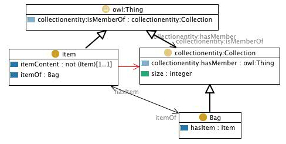

 __This pattern has been certified.__
Related submission, with evaluation history, can be found __here__

#  Graphical representation

__Diagram__

#  General description

  

#  Elements

_The __Bag__ Content OP locally defines the following ontology elements:_

 __Item__ (owl:Class) Item - Element belonging to a Bag 
  _[Item](../Submissions/Bag/Item.md "Submissions:Bag/Item") page_
 __itemContent__ (owl:ObjectProperty) itemContent - The link to the actual resource to which the item refers. 
  _[itemContent](../Submissions/Bag/itemContent.md "Submissions:Bag/itemContent") page_
 __Bag__ (owl:Class) Bag - Collection that can have a number of copies of each object 
  _[Bag](../Submissions/Bag/Bag.md "Submissions:Bag/Bag") page_
 __itemOf__ (owl:ObjectProperty) item of - The link from an item to the Bag where it is contained 
  _[itemOf](../Submissions/Bag/itemOf.md "Submissions:Bag/itemOf") page_
 __hasItem__ (owl:ObjectProperty) has item - The link to every item of the Bag 
  _[hasItem](../Submissions/Bag/hasItem.md "Submissions:Bag/hasItem") page_
 __size__ (owl:DatatypeProperty) size - The number of items belonging to a collection 
  _[size](../Submissions/Bag/size.md "Submissions:Bag/size") page_
#  Additional information

The Bag is characterized by a collection that can have multiple copies of each object. This is performed through the Item entity. The Item is linking exaclty one resource through the relationship itemContent.

  

The collections ontology (part of the SWAN ontologies) that this pattern is based on was created by Paolo Ciccarese - Massachusetts General Hospital/Harvard Medical School, and Marco Ocana - Balboa Systems Inc. The original ontologies, and related information, are available under a [Creative Commons License](http://creativecommons.org/licenses/by/1.0/ "http://creativecommons.org/licenses/by/1.0/").

#  Scenarios

__Scenarios about Bag__
No scenario is added to this Content OP.

#  Reviews

__Reviews about Bag__
There is no review about this proposal.
This revision (revision ID __10367__) takes in account the reviews: none

Other info at [evaluation tab](http://ontologydesignpatterns.org/wiki/index.php?title=Submissions:Bag&action=evaluation "http://ontologydesignpatterns.org/wiki/index.php?title=Submissions:Bag&action=evaluation")

  

#  Modeling issues

__Modeling issues about Bag__
There is no Modeling issue related to this proposal.

  

#  References

[Add a reference](index.php@title=Odp%253AAdd_reference&subject=../Submissions/Bag.md "http://ontologydesignpatterns.org/wiki/index.php?title=Odp:Add_reference&subject=Submissions%3ABag")

  

Retrieved from "[http://ontologydesignpatterns.org/wiki/Submissions:Bag](../Submissions/Bag.md)"
 [Category](http://ontologydesignpatterns.org/wiki/Special:Categories "Special:Categories"): [ProposedContentOP](../Category/ProposedContentOP.md "Category:ProposedContentOP")