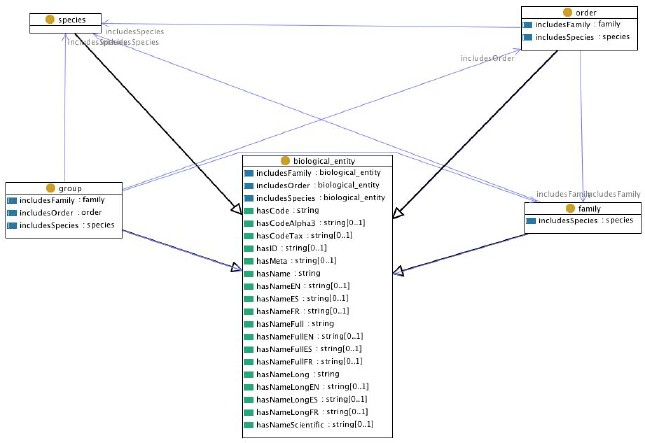

 __This pattern has been certified.__
Related submission, with evaluation history, can be found __here__

#  Graphical representation

__Diagram__

#  General description

  

#  Elements

_The __Biological Entities__ Content OP locally defines the following ontology elements:_

[Submissions:Biological Entities/biological entity](http://ontologydesignpatterns.org/wiki/Special:AddData/Ontology Element Form/Submissions:Biological_Entities/biological_entity "Submissions:Biological Entities/biological entity (not yet written)")  _[biological\_entity](http://ontologydesignpatterns.org/wiki/Special:AddData/Ontology Element Form/Submissions:Biological_Entities/biological_entity "Submissions:Biological Entities/biological entity (not yet written)") page_

 __family__ (owl:Class) A type of  [biological\_entity](http://ontologydesignpatterns.org/wiki/Special:AddData/Ontology Element Form/Submissions:Biological_Entities/biological_entity "Submissions:Biological Entities/biological entity (not yet written)"). It is disjoint with  [group](../Submissions/Biological_Entities/group.md "Submissions:Biological Entities/group"),  [order](../Submissions/Biological_Entities/order.md "Submissions:Biological Entities/order"), and  [species](../Submissions/Biological_Entities/species.md "Submissions:Biological Entities/species"). 

  _[family](../Submissions/Biological_Entities/family.md "Submissions:Biological Entities/family") page_

 __group__ (owl:Class) A type of  [biological\_entity](http://ontologydesignpatterns.org/wiki/Special:AddData/Ontology Element Form/Submissions:Biological_Entities/biological_entity "Submissions:Biological Entities/biological entity (not yet written)"). It is disjoint with  [family](../Submissions/Biological_Entities/family.md "Submissions:Biological Entities/family"),  [order](../Submissions/Biological_Entities/order.md "Submissions:Biological Entities/order"), and  [species](../Submissions/Biological_Entities/species.md "Submissions:Biological Entities/species"). 

  _[group](../Submissions/Biological_Entities/group.md "Submissions:Biological Entities/group") page_

 __species__ (owl:Class) A type of  [biological\_entity](http://ontologydesignpatterns.org/wiki/Special:AddData/Ontology Element Form/Submissions:Biological_Entities/biological_entity "Submissions:Biological Entities/biological entity (not yet written)"). It is disjoint with  [family](../Submissions/Biological_Entities/family.md "Submissions:Biological Entities/family"),  [order](../Submissions/Biological_Entities/order.md "Submissions:Biological Entities/order"), and  [group](../Submissions/Biological_Entities/group.md "Submissions:Biological Entities/group"). 

  _[species](../Submissions/Biological_Entities/species.md "Submissions:Biological Entities/species") page_

 __order__ (owl:Class) A type of  [biological\_entity](http://ontologydesignpatterns.org/wiki/Special:AddData/Ontology Element Form/Submissions:Biological_Entities/biological_entity "Submissions:Biological Entities/biological entity (not yet written)"). It is disjoint with  [family](../Submissions/Biological_Entities/family.md "Submissions:Biological Entities/family"),  [group](../Submissions/Biological_Entities/group.md "Submissions:Biological Entities/group"), and  [species](../Submissions/Biological_Entities/species.md "Submissions:Biological Entities/species"). 

  _[order](../Submissions/Biological_Entities/order.md "Submissions:Biological Entities/order") page_

 __includesOrder__ (owl:ObjectProperty) This object property relates two biological entities. In fact both its domain and its range are the class  [biological\_entity](http://ontologydesignpatterns.org/wiki/Special:AddData/Ontology Element Form/Submissions:Biological_Entities/biological_entity "Submissions:Biological Entities/biological entity (not yet written)")

  _[includesOrder](../Submissions/Biological_Entities/includesOrder.md "Submissions:Biological Entities/includesOrder") page_

 __includesFamily__ (owl:ObjectProperty) This object property relates two biological entities. In fact both its domain and its range are the class  [biological\_entity](http://ontologydesignpatterns.org/wiki/Special:AddData/Ontology Element Form/Submissions:Biological_Entities/biological_entity "Submissions:Biological Entities/biological entity (not yet written)")

  _[includesFamily](../Submissions/Biological_Entities/includesFamily.md "Submissions:Biological Entities/includesFamily") page_

 __includesSpecies__ (owl:ObjectProperty) This object property relates two biological entities. In fact both its domain and its range are the class  [biological\_entity](http://ontologydesignpatterns.org/wiki/Special:AddData/Ontology Element Form/Submissions:Biological_Entities/biological_entity "Submissions:Biological Entities/biological entity (not yet written)")

  _[includesSpecies](../Submissions/Biological_Entities/includesSpecies.md "Submissions:Biological Entities/includesSpecies") page_
[Submissions:Biological Entities/hasCode](http://ontologydesignpatterns.org/wiki/Special:AddData/Ontology Element Form/Submissions:Biological_Entities/hasCode "Submissions:Biological Entities/hasCode (not yet written)")  _[hasCode](http://ontologydesignpatterns.org/wiki/Special:AddData/Ontology Element Form/Submissions:Biological_Entities/hasCode "Submissions:Biological Entities/hasCode (not yet written)") page_
[Submissions:Biological Entities/hasID](http://ontologydesignpatterns.org/wiki/Special:AddData/Ontology Element Form/Submissions:Biological_Entities/hasID "Submissions:Biological Entities/hasID (not yet written)")  _[hasID](http://ontologydesignpatterns.org/wiki/Special:AddData/Ontology Element Form/Submissions:Biological_Entities/hasID "Submissions:Biological Entities/hasID (not yet written)") page_
[Submissions:Biological Entities/hasMeta](http://ontologydesignpatterns.org/wiki/Special:AddData/Ontology Element Form/Submissions:Biological_Entities/hasMeta "Submissions:Biological Entities/hasMeta (not yet written)")  _[hasMeta](http://ontologydesignpatterns.org/wiki/Special:AddData/Ontology Element Form/Submissions:Biological_Entities/hasMeta "Submissions:Biological Entities/hasMeta (not yet written)") page_
[Submissions:Biological Entities/hasName](http://ontologydesignpatterns.org/wiki/Special:AddData/Ontology Element Form/Submissions:Biological_Entities/hasName "Submissions:Biological Entities/hasName (not yet written)")  _[hasName](http://ontologydesignpatterns.org/wiki/Special:AddData/Ontology Element Form/Submissions:Biological_Entities/hasName "Submissions:Biological Entities/hasName (not yet written)") page_
[Submissions:Biological Entities/hasNameFull](http://ontologydesignpatterns.org/wiki/Special:AddData/Ontology Element Form/Submissions:Biological_Entities/hasNameFull "Submissions:Biological Entities/hasNameFull (not yet written)")  _[hasNameFull](http://ontologydesignpatterns.org/wiki/Special:AddData/Ontology Element Form/Submissions:Biological_Entities/hasNameFull "Submissions:Biological Entities/hasNameFull (not yet written)") page_
[Submissions:Biological Entities/hasNameScientific](http://ontologydesignpatterns.org/wiki/Special:AddData/Ontology Element Form/Submissions:Biological_Entities/hasNameScientific "Submissions:Biological Entities/hasNameScientific (not yet written)")  _[hasNameScientific](http://ontologydesignpatterns.org/wiki/Special:AddData/Ontology Element Form/Submissions:Biological_Entities/hasNameScientific "Submissions:Biological Entities/hasNameScientific (not yet written)") page_
#  Additional information

This proposal comes from one of the FAO ontologies developed in the context of the [NeOn project](http://www.neon-project.org "http://www.neon-project.org"). The author of the ontology here proposed as CP is [CaterinaCaracciolo](../User/CaterinaCaracciolo.md "User:CaterinaCaracciolo").

#  Scenarios

__Scenarios about Biological Entities__
No scenario is added to this Content OP.

#  Reviews

__Reviews about Biological Entities__
This revision (revision ID __9212__) takes in account the reviews: none

Other info at [evaluation tab](http://ontologydesignpatterns.org/wiki/index.php?title=Submissions:Biological_Entities&action=evaluation "http://ontologydesignpatterns.org/wiki/index.php?title=Submissions:Biological_Entities&action=evaluation")

  

#  Modeling issues

__Modeling issues about Biological Entities__
There is no Modeling issue related to this proposal.

  

#  References

[Add a reference](index.php@title=Odp%253AAdd_reference&subject=Submissions%253ABiological+Entities.html "http://ontologydesignpatterns.org/wiki/index.php?title=Odp:Add_reference&subject=Submissions%3ABiological+Entities")

* NeOn-FAO case study overview [Case study overview](http://aims.fao.org/website/NeON/sub2 "http://aims.fao.org/website/NeON/sub2") | [reference page](../Community/References/NeOn-FAO-Case-study.md "Community:References/NeOn-FAO-Case-study")
* Ontology-driven Stock Depletion Alert System [Documentation](http://www.neon-project.org/web-content/index.php?option=com_content&view=article&id=26&Itemid=46 "http://www.neon-project.org/web-content/index.php?option=com_content&view=article&id=26&Itemid=46") | [reference page](../Community/References/NeOn-FAO-Ontology-driven-Stock-Depletion-Alert-System.md "Community:References/NeOn-FAO-Ontology-driven-Stock-Depletion-Alert-System")

Retrieved from "[http://ontologydesignpatterns.org/wiki/Submissions:Biological\_Entities](../Submissions/Biological_Entities.md)"
 [Category](http://ontologydesignpatterns.org/wiki/Special:Categories "Special:Categories"): [ProposedContentOP](../Category/ProposedContentOP.md "Category:ProposedContentOP")