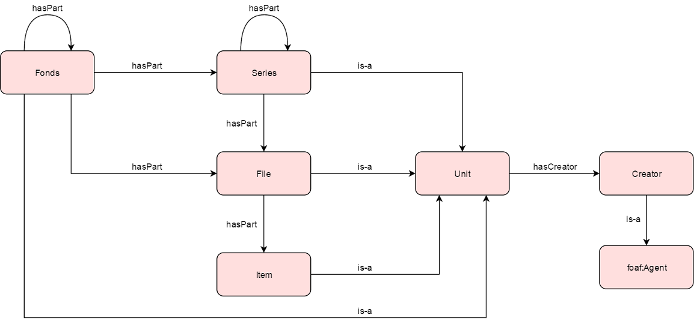

 __This pattern has been certified.__
Related submission, with evaluation history, can be found __here__

#  Graphical representation

__Diagram__

#  General description

  

#  Elements

_The __Born Digital Archives__ Content OP locally defines the following ontology elements:_

 __hasCreator__ (owl:ObjectProperty) Indicates the creator of a unit. 
  _[hasCreator](../Submissions/Born_Digital_Archives/hasCreator.md "Submissions:Born Digital Archives/hasCreator") page_
 __hasPart__ (owl:ObjectProperty) Indicates that a unit includes another unit. 
  _[hasPart](../Submissions/Born_Digital_Archives/hasPart.md "Submissions:Born Digital Archives/hasPart") page_
 __Creator__ (owl:Class) The creator of a born digital archive unit 
  _[Creator](../Submissions/Born_Digital_Archives/Creator.md "Submissions:Born Digital Archives/Creator") page_
 __File__ (owl:Class) An organized unit of documents grouped together either for current use by the creator or in the process of archival arrangement, because they relate to the same subject, activity, or transaction. A file is usually the basic unit within a record series. 
  _[File](../Submissions/Born_Digital_Archives/File.md "Submissions:Born Digital Archives/File") page_
 __Fonds__ (owl:Class) _Fonds_: The whole of the records, regardless of form or medium, organically created and/or accumulated and used by a particular person, family, or corporate body in the course of that creator's activities and functions.  

_Sub-fonds_: A subdivision of a fonds containing a body of related records corresponding to administrative subdivisions in the originating agency or organization or, when that is not possible, to geographical, chronological, functional, or similar groupings of the material itself. When the creating body has a complex hierarchical structure, each sub-fonds has as many subordinate sub-fonds as are necessary to reflect the levels of the hierarchical structure of the primary subordinate administrative unit. 

  _[Fonds](../Submissions/Born_Digital_Archives/Fonds.md "Submissions:Born Digital Archives/Fonds") page_
 __Item__ (owl:Class) The smallest intellectually indivisible archival unit, e.g., a letter, memorandum, report, photograph, sound recording. 
  _[Item](../Submissions/Born_Digital_Archives/Item.md "Submissions:Born Digital Archives/Item") page_
 __Series__ (owl:Class) Documents arranged in accordance with a filing system or maintained as a unit because they result from the same accumulation or filing process, or the same activity; have a particular form; or because of some other relationship arising out of their creation, receipt, or use. A series is also known as a records series. 
  _[Series](../Submissions/Born_Digital_Archives/Series.md "Submissions:Born Digital Archives/Series") page_
 __Unit__ (owl:Class) An entity that participates in the assembly of a born digital archive. 
  _[Unit](../Submissions/Born_Digital_Archives/Unit.md "Submissions:Born Digital Archives/Unit") page_
#  Additional information

#  Scenarios

__Scenarios about Born Digital Archives__
No scenario is added to this Content OP.

#  Reviews

__Reviews about Born Digital Archives__
There is no review about this proposal.
This revision (revision ID __13162__) takes in account the reviews: none

Other info at [evaluation tab](http://ontologydesignpatterns.org/wiki/index.php?title=Submissions:Born_Digital_Archives&action=evaluation "http://ontologydesignpatterns.org/wiki/index.php?title=Submissions:Born_Digital_Archives&action=evaluation")

  

#  Modeling issues

__Modeling issues about Born Digital Archives__
There is no Modeling issue related to this proposal.

  

#  References

[Add a reference](index.php@title=Odp%253AAdd_reference&subject=Submissions%253ABorn+Digital+Archives.html "http://ontologydesignpatterns.org/wiki/index.php?title=Odp:Add_reference&subject=Submissions%3ABorn+Digital+Archives")

  

Retrieved from "[http://ontologydesignpatterns.org/wiki/Submissions:Born\_Digital\_Archives](../Submissions/Born_Digital_Archives.md)"
 [Category](http://ontologydesignpatterns.org/wiki/Special:Categories "Special:Categories"): [ProposedContentOP](../Category/ProposedContentOP.md "Category:ProposedContentOP")