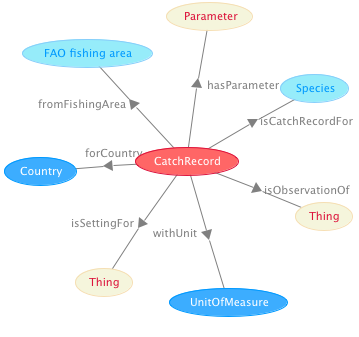

 __This pattern has been certified.__
Related submission, with evaluation history, can be found __here__

#  Graphical representation

__Diagram__

#  General description

  

#  Elements

_The __CatchRecord__ Content OP locally defines the following ontology elements:_

 __countryOfRecord__ (owl:ObjectProperty) The country parameter for a species catch record. 
  _[countryOfRecord](../Submissions/CatchRecord/countryOfRecord.md "Submissions:CatchRecord/countryOfRecord") page_
 __fishingAreaOfRecord__ (owl:ObjectProperty) The area parameter for a species catch record. 
  _[fishingAreaOfRecord](../Submissions/CatchRecord/fishingAreaOfRecord.md "Submissions:CatchRecord/fishingAreaOfRecord") page_
 __forCountry__ (owl:ObjectProperty) The country parameter for a species catch record. 
  _[forCountry](../Submissions/CatchRecord/forCountry.md "Submissions:CatchRecord/forCountry") page_
 __fromFishingArea__ (owl:ObjectProperty) The area parameter for a species catch record. 
  _[fromFishingArea](../Submissions/CatchRecord/fromFishingArea.md "Submissions:CatchRecord/fromFishingArea") page_
 __hasCatchRecord__ (owl:ObjectProperty) The catch record of a species, i.e. its statistical observation over a reference year. 
  _[hasCatchRecord](../Submissions/CatchRecord/hasCatchRecord.md "Submissions:CatchRecord/hasCatchRecord") page_
 __isCatchRecordFor__ (owl:ObjectProperty) The catch record of a species, i.e. its statistical observation over a reference year. 
  _[isCatchRecordFor](../Submissions/CatchRecord/isCatchRecordFor.md "Submissions:CatchRecord/isCatchRecordFor") page_
 __unitUsedInRecord__ (owl:ObjectProperty) The unit of measure parameter for a species catch record. 
  _[unitUsedInRecord](../Submissions/CatchRecord/unitUsedInRecord.md "Submissions:CatchRecord/unitUsedInRecord") page_
 __withUnit__ (owl:ObjectProperty) The unit of measure parameter for a species catch record. 
  _[withUnit](../Submissions/CatchRecord/withUnit.md "Submissions:CatchRecord/withUnit") page_
 __amount__ (owl:DatatypeProperty) 
  _[amount](../Submissions/CatchRecord/amount.md "Submissions:CatchRecord/amount") page_
 __referenceYear__ (owl:DatatypeProperty) The year for which the status of the target object (e.g. Marine Resource, Fishery...) has been evaluated. 
  _[referenceYear](../Submissions/CatchRecord/referenceYear.md "Submissions:CatchRecord/referenceYear") page_
 __reportingYear__ (owl:DatatypeProperty) The year in which a catch record has been officially reported (different from its reference year, i.e. the year of the actual observation). 
  _[reportingYear](../Submissions/CatchRecord/reportingYear.md "Submissions:CatchRecord/reportingYear") page_
 __CatchRecord__ (owl:Class) A design pattern representing the semantics of the data contained in a database view (record) about catches of species in certain fishing areas for a certain reference year. 
  _[CatchRecord](../Submissions/CatchRecord/CatchRecord.md "Submissions:CatchRecord/CatchRecord") page_
 __Country__ (owl:Class) 
  _[Country](../Submissions/CatchRecord/Country.md "Submissions:CatchRecord/Country") page_
 __UnitOfMeasure__ (owl:Class) 
  _[UnitOfMeasure](../Submissions/CatchRecord/UnitOfMeasure.md "Submissions:CatchRecord/UnitOfMeasure") page_
#  Additional information

A design pattern for populating an ontology of aquatic species catching records.

#  Scenarios

__Scenarios about CatchRecord__
No scenario is added to this Content OP.

#  Reviews

__Reviews about CatchRecord__
There is no review about this proposal.
This revision (revision ID __9069__) takes in account the reviews: none

Other info at [evaluation tab](http://ontologydesignpatterns.org/wiki/index.php?title=Submissions:CatchRecord&action=evaluation "http://ontologydesignpatterns.org/wiki/index.php?title=Submissions:CatchRecord&action=evaluation")

  

#  Modeling issues

__Modeling issues about CatchRecord__
There is no Modeling issue related to this proposal.

  

#  References

[Add a reference](index.php@title=Odp%253AAdd_reference&subject=../Submissions/CatchRecord.md "http://ontologydesignpatterns.org/wiki/index.php?title=Odp:Add_reference&subject=Submissions%3ACatchRecord")

  

Retrieved from "[http://ontologydesignpatterns.org/wiki/Submissions:CatchRecord](../Submissions/CatchRecord.md)"
 [Category](http://ontologydesignpatterns.org/wiki/Special:Categories "Special:Categories"): [ProposedContentOP](../Category/ProposedContentOP.md "Category:ProposedContentOP")