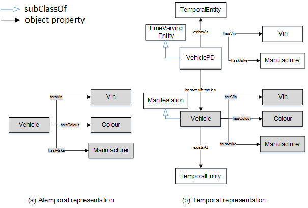

 __This pattern has been certified.__
Related submission, with evaluation history, can be found __here__

#  Graphical representation

__Diagram__

#  General information

  

#  Description

  

#  Example

  

#  Pattern reference

#  Additional information

#  Scenarios

__Scenarios about Change of Time Varying Entities__
No scenario is added to this Content OP.

#  Reviews

__Reviews about Change of Time Varying Entities__
There is no review about this proposal.
This revision (revision ID __13879__) takes in account the reviews: none

Other info at [evaluation tab](http://ontologydesignpatterns.org/wiki/index.php?title=Submissions:Change_of_Time_Varying_Entities&action=evaluation "http://ontologydesignpatterns.org/wiki/index.php?title=Submissions:Change_of_Time_Varying_Entities&action=evaluation")

  

#  Modeling issues

__Modeling issues about Change of Time Varying Entities__
There is no Modeling issue related to this proposal.

  

#  References

[Add a reference](index.php@title=Odp%253AAdd_reference&subject=Submissions%253AChange+of+Time+Varying+Entities.html "http://ontologydesignpatterns.org/wiki/index.php?title=Odp:Add_reference&subject=Submissions%3AChange+of+Time+Varying+Entities")

  

Retrieved from "[http://ontologydesignpatterns.org/wiki/Submissions:Change\_of\_Time\_Varying\_Entities](../Submissions/Change_of_Time_Varying_Entities)"
 [Categories](http://ontologydesignpatterns.org/wiki/Special:Categories "Special:Categories"): [LogicalOP](../Category/LogicalOP "Category:LogicalOP") | [ProposedLogicalOP](../Category/ProposedLogicalOP "Category:ProposedLogicalOP")