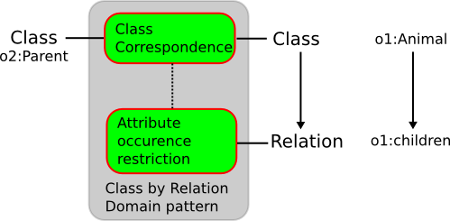

 __This pattern has been certified.__
Related submission, with evaluation history, can be found __here__

#  Graphical representation

__Diagram__

#  General information

  

#  Description

  

#  Example

  

#  Reference

  

#  Scenarios

__Scenarios about Class correspondence defined by relation domain__
No scenario is added to this Content OP.

#  Reviews

__Reviews about Class correspondence defined by relation domain__
There is no review about this proposal.
This revision (revision ID __8790__) takes in account the reviews: none

Other info at [evaluation tab](http://ontologydesignpatterns.org/wiki/index.php?title=Submissions:Class_correspondence_defined_by_relation_domain&action=evaluation "http://ontologydesignpatterns.org/wiki/index.php?title=Submissions:Class_correspondence_defined_by_relation_domain&action=evaluation")

  

#  Modeling issues

__Modeling issues about Class correspondence defined by relation domain__
There is no Modeling issue related to this proposal.

  

#  References

[Add a reference](index.php@title=Odp%253AAdd_reference&subject=Submissions%253AClass+correspondence+defined+by+relation+domain.html "http://ontologydesignpatterns.org/wiki/index.php?title=Odp:Add_reference&subject=Submissions%3AClass+correspondence+defined+by+relation+domain")

  

Retrieved from "[http://ontologydesignpatterns.org/wiki/Submissions:Class\_correspondence\_defined\_by\_relation\_domain](../Submissions/Class_correspondence_defined_by_relation_domain)"
 [Categories](http://ontologydesignpatterns.org/wiki/Special:Categories "Special:Categories"): [ProposedAlignmentOP](../Category/ProposedAlignmentOP "Category:ProposedAlignmentOP") | [AlignmentOP](../Category/AlignmentOP "Category:AlignmentOP")