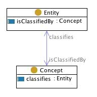

 __This pattern has been certified.__
Related submission, with evaluation history, can be found __here__

#  Graphical representation

__Diagram__

#  General description

  

#  Elements

_The __Classification__ Content OP locally defines the following ontology elements:_

 __Concept__ (owl:Class) A concept is a Social Object. The  [classifies](../Submissions/Classification/classifies.md "Submissions:Classification/classifies") relation relates concepts to entities at some time 

  _[Concept](../Submissions/Classification/Concept.md "Submissions:Classification/Concept") page_

 __Entity__ (owl:Class) Anything: real, possible, or imaginary, which some modeller wants to talk about for some purpose. 

  _[Entity](../Submissions/Classification/Entity.md "Submissions:Classification/Entity") page_

 __classifies__ (owl:ObjectProperty) A relation between a  [Concept](../Submissions/Classification/Concept.md "Submissions:Classification/Concept") and an  [Entity](../Submissions/Classification/Entity.md "Submissions:Classification/Entity"), e.g. the Role 'student' classifies a Person 'John'. 

  _[classifies](../Submissions/Classification/classifies.md "Submissions:Classification/classifies") page_

 __is classified by__ (owl:ObjectProperty) A relation between a  [Concept](../Submissions/Classification/Concept.md "Submissions:Classification/Concept") and an  [Entity](../Submissions/Classification/Entity.md "Submissions:Classification/Entity"), e.g. 'John is considered a typical rude man'; your last concert constitutes the achievement of a lifetime; '20-year-old means she's mature enough'. 

  _[isClassifiedBy](../Submissions/Classification/isClassifiedBy.md "Submissions:Classification/isClassifiedBy") page_
#  Additional information

#  Scenarios

__Scenarios about Classification__
No scenario is added to this Content OP.

#  Reviews

__Reviews about Classification__
This revision (revision ID __9070__) takes in account the reviews: none

Other info at [evaluation tab](http://ontologydesignpatterns.org/wiki/index.php?title=Submissions:Classification&action=evaluation "http://ontologydesignpatterns.org/wiki/index.php?title=Submissions:Classification&action=evaluation")

  

#  Modeling issues

__Modeling issues about Classification__

  

#  References

[Add a reference](index.php@title=Odp%253AAdd_reference&subject=../Submissions/Classification.md "http://ontologydesignpatterns.org/wiki/index.php?title=Odp:Add_reference&subject=Submissions%3AClassification")

  

Retrieved from "[http://ontologydesignpatterns.org/wiki/Submissions:Classification](../Submissions/Classification.md)"
 [Category](http://ontologydesignpatterns.org/wiki/Special:Categories "Special:Categories"): [ProposedContentOP](../Category/ProposedContentOP.md "Category:ProposedContentOP")