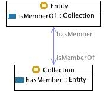

 __This pattern has been certified.__
Related submission, with evaluation history, can be found __here__

#  Graphical representation

__Diagram__

#  General description

  

#  Elements

_The __CollectionEntity__ Content OP locally defines the following ontology elements:_

 __Collection__ (owl:Class) Any container for entities that share one or more common properties. E.g. _stone objects_, _the nurses_, _the Louvre Aegyptian collection_. A collection is not a logical class: a collection is a first-order entity, while a class is a second-order one. 

  _[Collection](../Submissions/CollectionEntity/Collection.md "Submissions:CollectionEntity/Collection") page_

 __Entity__ (owl:Class) Anything: real, possible, or imaginary, which some modeller wants to talk about for some purpose. 

  _[Entity](../Submissions/CollectionEntity/Entity.md "Submissions:CollectionEntity/Entity") page_

 __hasMember__ (owl:ObjectProperty) A relation between collections and entities, e.g. 'my collection of saxophones includes an old Adolphe Sax original alto' (i.e. my collection has member an Adolphe Sax alto). The object property  [isMemberOf](../Submissions/CollectionEntity/isMemberOf.md "Submissions:CollectionEntity/isMemberOf") is its inverse. 

  _[hasMember](../Submissions/CollectionEntity/hasMember.md "Submissions:CollectionEntity/hasMember") page_

 __isMemberOf__ (owl:ObjectProperty) The inverse of  [hasMember](../Submissions/CollectionEntity/hasMember.md "Submissions:CollectionEntity/hasMember"). 

  _[isMemberOf](../Submissions/CollectionEntity/isMemberOf.md "Submissions:CollectionEntity/isMemberOf") page_
#  Additional information

#  Scenarios

__Scenarios about CollectionEntity__
* Aldo, Alfio and Valentina are members of the STLab. [>>>](../Submissions/CollectionEntity/Scenario_1.md "http://ontologydesignpatterns.org/wiki/Submissions:CollectionEntity/Scenario_1")

#  Reviews

__Reviews about CollectionEntity__
There is no review about this proposal.
This revision (revision ID __9075__) takes in account the reviews: [ValentinaPresutti about CollectionEntity](http://ontologydesignpatterns.org/wiki/index.php?title=Reviews:ValentinaPresutti_about_CollectionEntity&action=edit&redlink=1 "Reviews:ValentinaPresutti about CollectionEntity (not yet written)")

Other info at [evaluation tab](http://ontologydesignpatterns.org/wiki/index.php?title=Submissions:CollectionEntity&action=evaluation "http://ontologydesignpatterns.org/wiki/index.php?title=Submissions:CollectionEntity&action=evaluation")

  

#  Modeling issues

__Modeling issues about CollectionEntity__
There is no Modeling issue related to this proposal.

  

#  References

[Add a reference](index.php@title=Odp%253AAdd_reference&subject=../Submissions/CollectionEntity.md "http://ontologydesignpatterns.org/wiki/index.php?title=Odp:Add_reference&subject=Submissions%3ACollectionEntity")

  

Retrieved from "[http://ontologydesignpatterns.org/wiki/Submissions:CollectionEntity](../Submissions/CollectionEntity.md)"
 [Category](http://ontologydesignpatterns.org/wiki/Special:Categories "Special:Categories"): [ProposedContentOP](../Category/ProposedContentOP.md "Category:ProposedContentOP")