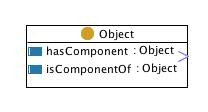

 __This pattern has been certified.__
Related submission, with evaluation history, can be found __here__

#  Graphical representation

__Diagram__

#  General description

  

#  Elements

_The __Componency__ Content OP locally defines the following ontology elements:_

 __Object__ (owl:Class) Any physical, social, or mental object, or a substance. Can be component only of other objects, and can be composed of only other objects. 

  _[Object](../Submissions/Componency/Object.md "Submissions:Componency/Object") page_

 __hasComponent__ (owl:ObjectProperty) The  [hasPart](../Submissions/PartOf/hasPart.md "Submissions:PartOf/hasPart") relation without transitivity, holding between an  [Object](../Submissions/Componency/Object.md "Submissions:Componency/Object") (the system) and another (the component), and assuming a Design that structures the system Object. 
The componency Content OP uses the transitive reduction  [logical pattern](../Category/LogicalOP.md "Category:LogicalOP") to preserve transitive on the superproperty from the [part of](../Submissions/PartOf.md "Submissions:PartOf") Content OP. In practice, the [part of](../Submissions/PartOf.md "Submissions:PartOf") acts here as the transitive reduction of the  __componency__ Content OP. 

  _[hasComponent](../Submissions/Componency/hasComponent.md "Submissions:Componency/hasComponent") page_

 __isComponentOf__ (owl:ObjectProperty) The inverse of the  [hasComponent](../Submissions/Componency/hasComponent.md "Submissions:Componency/hasComponent")  object property. 

  _[isComponentOf](../Submissions/Componency/isComponentOf.md "Submissions:Componency/isComponentOf") page_
#  Additional information

This Content OP defines the above elements, it also includes the elements of  [part of](../Submissions/PartOf.md "Submissions:PartOf") Content OP.

#  Scenarios

__Scenarios about Componency__
No scenario is added to this Content OP.

#  Reviews

__Reviews about Componency__
There is no review about this proposal.
This revision (revision ID __9077__) takes in account the reviews: none

Other info at [evaluation tab](http://ontologydesignpatterns.org/wiki/index.php?title=Submissions:Componency&action=evaluation "http://ontologydesignpatterns.org/wiki/index.php?title=Submissions:Componency&action=evaluation")

  

#  Modeling issues

__Modeling issues about Componency__
There is no Modeling issue related to this proposal.

  

#  References

[Add a reference](index.php@title=Odp%253AAdd_reference&subject=../Submissions/Componency.md "http://ontologydesignpatterns.org/wiki/index.php?title=Odp:Add_reference&subject=Submissions%3AComponency")

  

Retrieved from "[http://ontologydesignpatterns.org/wiki/Submissions:Componency](../Submissions/Componency.md)"
 [Category](http://ontologydesignpatterns.org/wiki/Special:Categories "Special:Categories"): [ProposedContentOP](../Category/ProposedContentOP.md "Category:ProposedContentOP")