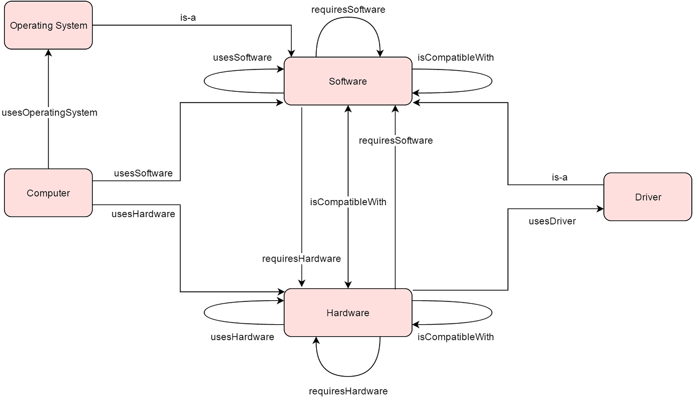

 __This pattern has been certified.__
Related submission, with evaluation history, can be found __here__

#  Graphical representation

__Diagram__

#  General description

  

#  Elements

_The __Computer System__ Content OP locally defines the following ontology elements:_

 __isCompatibleWith__ (owl:ObjectProperty) Represents the relationship of compatibility between two components. 
  _[isCompatibleWith](../Submissions/Computer_System/isCompatibleWith "Submissions:Computer System/isCompatibleWith") page_
 __requiresHardware__ (owl:ObjectProperty) Indicates that an entity requires a certain piece of hardware to operate. 
  _[requiresHardware](../Submissions/Computer_System/requiresHardware "Submissions:Computer System/requiresHardware") page_
 __requiresSoftware__ (owl:ObjectProperty) Indicates that an entity requires a certain piece of software to operate. 
  _[requiresSoftware](../Submissions/Computer_System/requiresSoftware "Submissions:Computer System/requiresSoftware") page_
 __usesDriver__ (owl:ObjectProperty) Indicates the usage of a specific driver. 
  _[usesDriver](../Submissions/Computer_System/usesDriver "Submissions:Computer System/usesDriver") page_
 __usesHardware__ (owl:ObjectProperty) Indicates the usage of a specific piece of hardware. 
  _[usesHardware](../Submissions/Computer_System/usesHardware "Submissions:Computer System/usesHardware") page_
 __usesOperatingSystem__ (owl:ObjectProperty) Indicates the usage of a certain Operating System. 
  _[usesOperatingSystem](../Submissions/Computer_System/usesOperatingSystem "Submissions:Computer System/usesOperatingSystem") page_
 __usesSoftware__ (owl:ObjectProperty) Indicates the usage of a specific piece of software. 
  _[usesSoftware](../Submissions/Computer_System/usesSoftware "Submissions:Computer System/usesSoftware") page_
 __Computer__ (owl:Class) This entity represents computers of any type, size, cost and application. 
  _[Computer](../Submissions/Computer_System/Computer "Submissions:Computer System/Computer") page_
 __Driver__ (owl:Class) A computer program that operates or controls a particular type of device that is attached to a computer. 
  _[Driver](../Submissions/Computer_System/Driver "Submissions:Computer System/Driver") page_
 __Hardware__ (owl:Class) A physical component or a collection of physical components used by (or within or aside) a computer. 
  _[Hardware](../Submissions/Computer_System/Hardware "Submissions:Computer System/Hardware") page_
 __OperatingSystem__ (owl:Class) A system software that manages computer hardware and software resources and provides common services for computer programs. 
  _[OperatingSystem](../Submissions/Computer_System/OperatingSystem "Submissions:Computer System/OperatingSystem") page_
 __Software__ (owl:Class) Part of a computer system that consists of encoded information or computer instructions. 
  _[Software](../Submissions/Computer_System/Software "Submissions:Computer System/Software") page_
#  Additional information

#  Scenarios

__Scenarios about Computer System__
No scenario is added to this Content OP.

#  Reviews

__Reviews about Computer System__
There is no review about this proposal.
This revision (revision ID __13196__) takes in account the reviews: none

Other info at [evaluation tab](http://ontologydesignpatterns.org/wiki/index.php?title=Submissions:Computer_System&action=evaluation "http://ontologydesignpatterns.org/wiki/index.php?title=Submissions:Computer_System&action=evaluation")

  

#  Modeling issues

__Modeling issues about Computer System__
There is no Modeling issue related to this proposal.

  

#  References

[Add a reference](index.php@title=Odp%253AAdd_reference&subject=Submissions%253AComputer+System.html "http://ontologydesignpatterns.org/wiki/index.php?title=Odp:Add_reference&subject=Submissions%3AComputer+System")

  

Retrieved from "[http://ontologydesignpatterns.org/wiki/Submissions:Computer\_System](../Submissions/Computer_System)"
 [Category](http://ontologydesignpatterns.org/wiki/Special:Categories "Special:Categories"): [ProposedContentOP](../Category/ProposedContentOP "Category:ProposedContentOP")