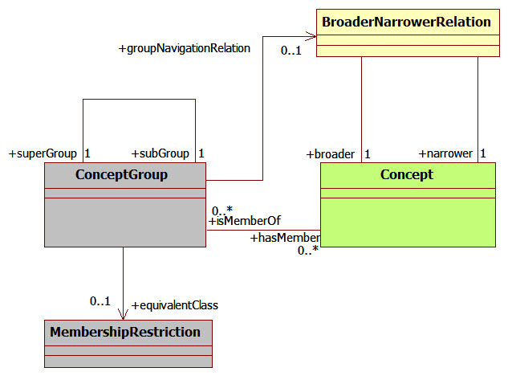

 __This pattern has been certified.__
Related submission, with evaluation history, can be found __here__

#  General description

  

#  Elements

_The __ConceptGroup__ Content OP locally defines the following ontology elements:_

  

#  Scenarios

__Scenarios about ConceptGroup__
No scenario is added to this Content OP.

#  Reviews

__Reviews about ConceptGroup__
This revision (revision ID __5799__) takes in account the reviews: none

Other info at [evaluation tab](http://ontologydesignpatterns.org/wiki/index.php?title=Submissions:ConceptGroup&action=evaluation "http://ontologydesignpatterns.org/wiki/index.php?title=Submissions:ConceptGroup&action=evaluation")

  

Retrieved from "[http://ontologydesignpatterns.org/wiki/Submissions:ConceptGroup](../Submissions/ConceptGroup)"
 [Categories](http://ontologydesignpatterns.org/wiki/Special:Categories "Special:Categories"): [ProposedContentOP](../Category/ProposedContentOP "Category:ProposedContentOP") | [Submitted to event](../Category/Submitted_to_event "Category:Submitted to event") | [Review assigned](../Category/Review_assigned "Category:Review assigned")