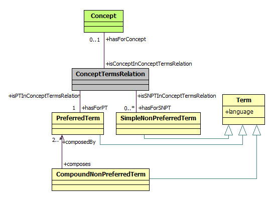

 __This pattern has been certified.__
Related submission, with evaluation history, can be found __here__

#  General description

  

#  Elements

_The __ConceptTerms__ Content OP locally defines the following ontology elements:_

  

#  Scenarios

__Scenarios about ConceptTerms__
* This ontology contains an example ABox for the ConceptTerms CP available at [http://sites.google.com/site/pierreyvesvandenbussche/resources/ConceptTerms.owl](http://sites.google.com/site/pierreyvesvandenbussche/resources/ConceptTerms.owl "http://sites.google.com/site/pierreyvesvandenbussche/resources/ConceptTerms.owl")

 This ontology describes example coming from Eurovoc([http://europa.eu/eurovoc/](http://europa.eu/eurovoc/ "http://europa.eu/eurovoc/")) where a concept has a preferred term "social sciences" in english and a simple non preferred term (i.e. synonyms) "humanities" in the same language whereas the same concept has a preferred term "sciences sociales" in french and a simple non preferred term "sciences humaines" in this language. We consider a second preferred term in english "award" which names a concept. In this particular information retrieval context, we define a coumpound non preferred term "social sciences awards" which is related to preferred terms "social sciences" and "award". [>>>](../Submissions/ConceptTerms/Scenario_1.md "http://ontologydesignpatterns.org/wiki/Submissions:ConceptTerms/Scenario_1")

#  Reviews

__Reviews about ConceptTerms__
This revision (revision ID __5714__) takes in account the reviews: [WimPeters about ConceptTerms](../Reviews/WimPeters_about_ConceptTerms.md "Reviews:WimPeters about ConceptTerms"), [VojtechSvatek about ConceptTerms](../Reviews/VojtechSvatek_about_ConceptTerms.md "Reviews:VojtechSvatek about ConceptTerms"), [MariCarmenSuarezFigueroa about ConceptTerms](../Reviews/MariCarmenSuarezFigueroa_about_ConceptTerms.md "Reviews:MariCarmenSuarezFigueroa about ConceptTerms")

Other info at [evaluation tab](http://ontologydesignpatterns.org/wiki/index.php?title=Submissions:ConceptTerms&action=evaluation "http://ontologydesignpatterns.org/wiki/index.php?title=Submissions:ConceptTerms&action=evaluation")

  

Retrieved from "[http://ontologydesignpatterns.org/wiki/Submissions:ConceptTerms](../Submissions/ConceptTerms.md)"
 [Categories](http://ontologydesignpatterns.org/wiki/Special:Categories "Special:Categories"): [ProposedContentOP](../Category/ProposedContentOP.md "Category:ProposedContentOP") | [Submitted to event](../Category/Submitted_to_event.md "Category:Submitted to event") | [Review assigned](../Category/Review_assigned.md "Category:Review assigned")