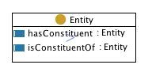

 __This pattern has been certified.__
Related submission, with evaluation history, can be found __here__

#  Graphical representation

__Diagram__

#  General description

  

#  Elements

_The __Constituency__ Content OP locally defines the following ontology elements:_

 __Entity__ (owl:Class) Anything: real, possible, or imaginary, which some modeller wants to talk about for some purpose. 

  _[Entity](../Submissions/Constituency/Entity.md "Submissions:Constituency/Entity") page_

 __hasConstituent__ (owl:ObjectProperty) Constituency depends on some layering of the world described by the ontology. 
For example, scientific granularity (e.g. body-organ-tissue-cell) or ontological 'strata' (e.g. social-mental-biological-physical) are typical layerings. Intuitively, a constituent is a part belonging to a lower 
layer. Since layering is actually a partition of the world described by the ontology, constituents are not properly classified as parts, although this kindship can be intuitive for common sense. Example of constituents include the wood pieces constituting a table, the persons constituting a social system, the 
molecules constituting a person, the atoms constituting a river, etc. In all these examples, we notice a typical discontinuity between the constituted and the constituent object: e.g. a table is conceptualized at a functional layer, while wood pieces are conceptualized at a material layer, a social system is 
conceptualized at a different layer from the persons that constitute it, a person is conceptualized at a different layer from the molecules that constitute them, and a river is conceptualized at a different layer from the atoms that constitute it. The object property  [isConstituentOf](../Submissions/Constituency/isConstituentOf.md "Submissions:Constituency/isConstituentOf") is its inverse. 

  _[hasConstituent](../Submissions/Constituency/hasConstituent.md "Submissions:Constituency/hasConstituent") page_

 __isConstituentOf__ (owl:ObjectProperty) The inverse of the  [hasConstituent](../Submissions/Constituency/hasConstituent.md "Submissions:Constituency/hasConstituent") object property. 

  _[isConstituentOf](../Submissions/Constituency/isConstituentOf.md "Submissions:Constituency/isConstituentOf") page_
#  Additional information

#  Scenarios

__Scenarios about Constituency__
No scenario is added to this Content OP.

#  Reviews

__Reviews about Constituency__
There is no review about this proposal.
This revision (revision ID __9080__) takes in account the reviews: none

Other info at [evaluation tab](http://ontologydesignpatterns.org/wiki/index.php?title=Submissions:Constituency&action=evaluation "http://ontologydesignpatterns.org/wiki/index.php?title=Submissions:Constituency&action=evaluation")

  

#  Modeling issues

__Modeling issues about Constituency__
There is no Modeling issue related to this proposal.

  

#  References

[Add a reference](index.php@title=Odp%253AAdd_reference&subject=../Submissions/Constituency.md "http://ontologydesignpatterns.org/wiki/index.php?title=Odp:Add_reference&subject=Submissions%3AConstituency")

  

Retrieved from "[http://ontologydesignpatterns.org/wiki/Submissions:Constituency](../Submissions/Constituency.md)"
 [Category](http://ontologydesignpatterns.org/wiki/Special:Categories "Special:Categories"): [ProposedContentOP](../Category/ProposedContentOP.md "Category:ProposedContentOP")