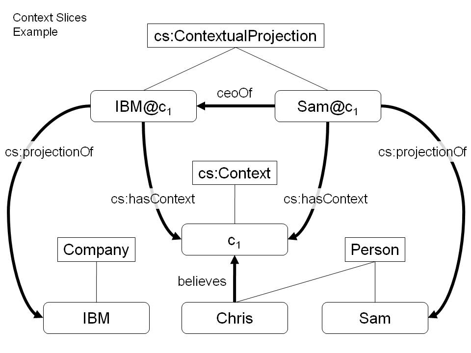

 __This pattern has been certified.__
Related submission, with evaluation history, can be found __here__

#  Graphical representation

__Diagram__

#  General information

  

#  Description

  

#  Example

  

#  Pattern reference

  

#  Additional information

#  Scenarios

__Scenarios about Context Slices__
No scenario is added to this Content OP.

#  Reviews

__Reviews about Context Slices__
This revision (revision ID __10228__) takes in account the reviews: [ValentinaPresutti about Context Slices](../Reviews/ValentinaPresutti_about_Context_Slices "Reviews:ValentinaPresutti about Context Slices")

Other info at [evaluation tab](http://ontologydesignpatterns.org/wiki/index.php?title=Submissions:Context_Slices&action=evaluation "http://ontologydesignpatterns.org/wiki/index.php?title=Submissions:Context_Slices&action=evaluation")

  

#  Modeling issues

__Modeling issues about Context Slices__
There is no Modeling issue related to this proposal.

  

#  References

[Add a reference](index.php@title=Odp%253AAdd_reference&subject=Submissions%253AContext+Slices.html "http://ontologydesignpatterns.org/wiki/index.php?title=Odp:Add_reference&subject=Submissions%3AContext+Slices")

  

Retrieved from "[http://ontologydesignpatterns.org/wiki/Submissions:Context\_Slices](../Submissions/Context_Slices)"
 [Categories](http://ontologydesignpatterns.org/wiki/Special:Categories "Special:Categories"): [LogicalOP](../Category/LogicalOP "Category:LogicalOP") | [ProposedLogicalOP](../Category/ProposedLogicalOP "Category:ProposedLogicalOP") | [Review assigned](../Category/Review_assigned "Category:Review assigned") | [Submitted to event](../Category/Submitted_to_event "Category:Submitted to event")