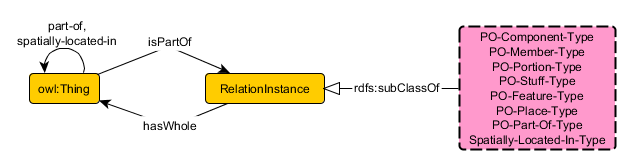

 __This pattern has been certified.__
Related submission, with evaluation history, can be found __here__

#  Graphical representation

__Diagram__

#  General description

  

#  Elements

_The __ContextualizedWinstonPartWhole__ Content OP locally defines the following ontology elements:_

 __IsPartOf__ (owl:ObjectProperty) 
  _[IsPartOf](../Submissions/ContextualizedWinstonPartWhole/IsPartOf.md "Submissions:ContextualizedWinstonPartWhole/IsPartOf") page_
 __hasWhole__ (owl:ObjectProperty) 
  _[hasWhole](../Submissions/ContextualizedWinstonPartWhole/hasWhole.md "Submissions:ContextualizedWinstonPartWhole/hasWhole") page_
 __part-of__ (owl:ObjectProperty) 
  _[part-of](../Submissions/ContextualizedWinstonPartWhole/part-of.md "Submissions:ContextualizedWinstonPartWhole/part-of") page_
 __spatially-located-in__ (owl:ObjectProperty) 
  _[spatially-located-in](../Submissions/ContextualizedWinstonPartWhole/spatially-located-in.md "Submissions:ContextualizedWinstonPartWhole/spatially-located-in") page_
 __PO-Component-Type__ (owl:Class) 
  _[PO-Component-Type](../Submissions/ContextualizedWinstonPartWhole/PO-Component-Type.md "Submissions:ContextualizedWinstonPartWhole/PO-Component-Type") page_
 __PO-Feature-Type__ (owl:Class) 
  _[PO-Feature-Type](../Submissions/ContextualizedWinstonPartWhole/PO-Feature-Type.md "Submissions:ContextualizedWinstonPartWhole/PO-Feature-Type") page_
 __PO-Member-Type__ (owl:Class) 
  _[PO-Member-Type](../Submissions/ContextualizedWinstonPartWhole/PO-Member-Type.md "Submissions:ContextualizedWinstonPartWhole/PO-Member-Type") page_
 __PO-Part-Of\_Type__ (owl:Class) 
  _[PO-Part-Of\_Type](../Submissions/ContextualizedWinstonPartWhole/PO-Part-Of_Type.md "Submissions:ContextualizedWinstonPartWhole/PO-Part-Of Type") page_
 __PO-Place-Type__ (owl:Class) 
  _[PO-Place-Type](../Submissions/ContextualizedWinstonPartWhole/PO-Place-Type.md "Submissions:ContextualizedWinstonPartWhole/PO-Place-Type") page_
 __PO-Portion-Type__ (owl:Class) 
  _[PO-Portion-Type](../Submissions/ContextualizedWinstonPartWhole/PO-Portion-Type.md "Submissions:ContextualizedWinstonPartWhole/PO-Portion-Type") page_
 __PO-Stuff-Type__ (owl:Class) 
  _[PO-Stuff-Type](../Submissions/ContextualizedWinstonPartWhole/PO-Stuff-Type.md "Submissions:ContextualizedWinstonPartWhole/PO-Stuff-Type") page_
 __RelationInstance__ (owl:Class) 
  _[RelationInstance](../Submissions/ContextualizedWinstonPartWhole/RelationInstance.md "Submissions:ContextualizedWinstonPartWhole/RelationInstance") page_
 __Spatially-Located-In-Type__ (owl:Class) 
  _[Spatially-Located-In-Type](../Submissions/ContextualizedWinstonPartWhole/Spatially-Located-In-Type.md "Submissions:ContextualizedWinstonPartWhole/Spatially-Located-In-Type") page_
#  Additional information

#  Scenarios

__Scenarios about ContextualizedWinstonPartWhole__
No scenario is added to this Content OP.

#  Reviews

__Reviews about ContextualizedWinstonPartWhole__
There is no review about this proposal.
This revision (revision ID __13540__) takes in account the reviews: none

Other info at [evaluation tab](http://ontologydesignpatterns.org/wiki/index.php?title=Submissions:ContextualizedWinstonPartWhole&action=evaluation "http://ontologydesignpatterns.org/wiki/index.php?title=Submissions:ContextualizedWinstonPartWhole&action=evaluation")

  

#  Modeling issues

__Modeling issues about ContextualizedWinstonPartWhole__
There is no Modeling issue related to this proposal.

  

#  References

[Add a reference](index.php@title=Odp%253AAdd_reference&subject=../Submissions/ContextualizedWinstonPartWhole.md "http://ontologydesignpatterns.org/wiki/index.php?title=Odp:Add_reference&subject=Submissions%3AContextualizedWinstonPartWhole")

  

Retrieved from "[http://ontologydesignpatterns.org/wiki/Submissions:ContextualizedWinstonPartWhole](../Submissions/ContextualizedWinstonPartWhole.md)"
 [Category](http://ontologydesignpatterns.org/wiki/Special:Categories "Special:Categories"): [ProposedContentOP](../Category/ProposedContentOP.md "Category:ProposedContentOP")